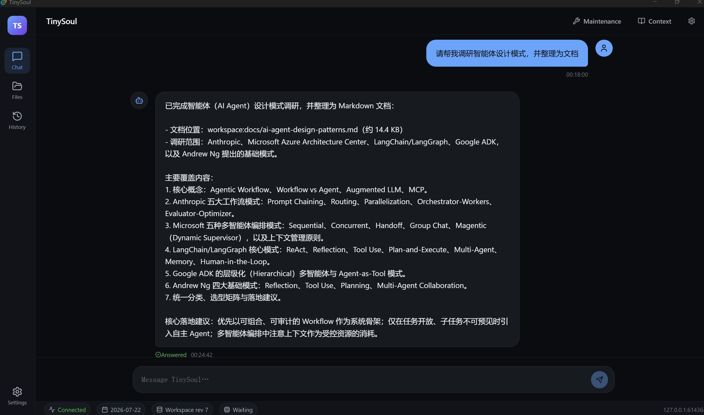
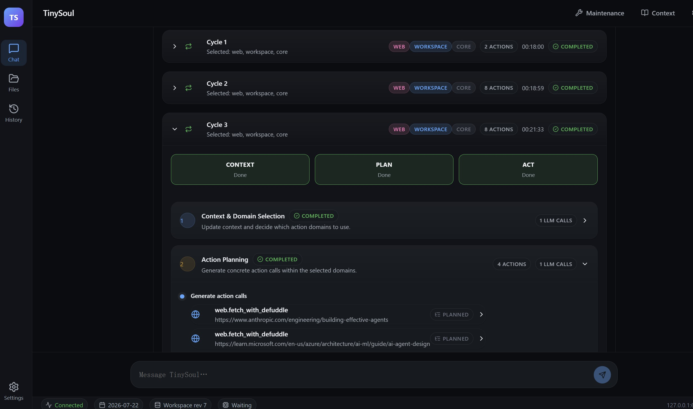
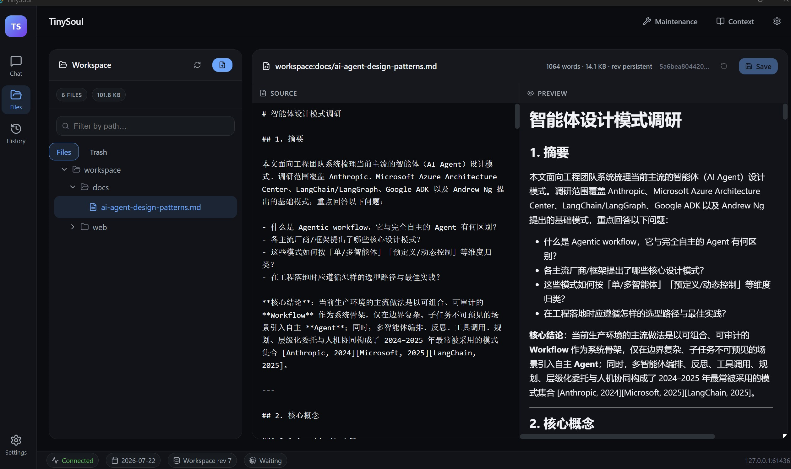

# TinySoul

TinySoul is a local, provider-neutral LLM agent runtime built around explicit Context, Action, Session, Workspace, Agent Home, Memory, and daily lifecycle boundaries.

Python 3.13 or newer is required.

## Standard

Install TinySoul and create a backend project:

```powershell
python -m pip install .
tinysoul init my-agent
```

Enable a provider in `my-agent/configs/llm.providers.toml` and add its credentials to `my-agent/.env`, then start the backend:

```powershell
tinysoul start --root my-agent --mode normal
```

For one non-interactive turn:

```powershell
tinysoul start --root my-agent --once "Summarize today's work"
```

## Development

The development profile enables the repository maintainer's provider and capability settings, but contains no credentials.

### Backend

Install TinySoul and create a development project:

```powershell
python -m pip install -e ".[dev]"
tinysoul init my-agent-dev --config-profile development
```

Add the required credentials to `my-agent-dev/.env`, then start the backend:

```powershell
tinysoul start --root my-agent-dev --mode normal
```

To rebuild the development project from the packaged Home and configuration templates:

```powershell
tinysoul reset my-agent-dev
```

Run `reset` from outside the target directory. It preserves `.env` and replaces everything else, including runtime data, conversations, Memory, archives, and `.git`.

### Frontend

Keep the backend running, then start the desktop frontend in another terminal. The frontend requires Node.js 20+, pnpm, and Rust 1.97+.

```powershell
cd visualization
pnpm install
pnpm tauri dev
```

The frontend discovers the running TinySoul project automatically and does not manage the backend process.

### Checks

```powershell
.\scripts\test.ps1
.\scripts\test.ps1 -TestPath tests/action/test_backends_engine.py
.\scripts\test.ps1 -Suite Full
$env:TINYSOUL_PYTHON=(Get-Command python).Source
.\scripts\typecheck.ps1
```

`test.ps1` runs the Fast local pytest suite by default and creates a unique isolated run root under `.local-test/runs/`. Use `-TestPath` for focused feedback and `-Suite Full` for the completion gate, which includes wheel build and isolated-install checks. Real-provider and opt-in network tests are excluded from Fast and Full and can only be selected with `-Suite External` plus their existing environment switches. If PowerShell blocks local script execution, invoke the same script with `powershell.exe -NoProfile -ExecutionPolicy Bypass -File .\scripts\test.ps1`. `typecheck.ps1` runs `ty` with the selected Python environment.

Architecture and module contracts are under `docs/design/`; the desktop frontend is documented in `visualization/README.md`.


## Cases








