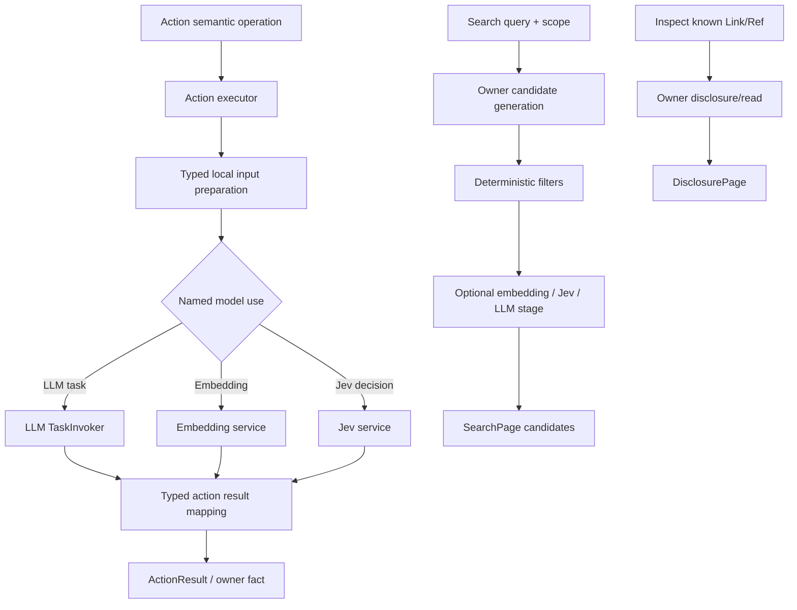

# Action 模型使用与信息检索统一重构执行计划

状态：`pending`

日期：2026-09-24

本计划是实施前的完整方案预览。它基于 `AGENTS.md`、当前代码、`docs/chat/20260924-visualization-backend-support-plan-r4.md`、`docs/chat/20260924-action-model-usage-architecture-proposal.md`、现有模块设计文档，以及 `docs/example/JevUse/` 的接口说明整理。当前不修改后端实现；在方案确认后，按本计划一次性完成重构，不保留旧接口和旧配置的兼容层。

本次复核结论：总体方向成立，但必须把“Action 的逻辑实现”和“执行承载方式”分层；必须把“配置允许哪些模型”和“本次 Action 选择哪种检索模式”分开；必须把已有 Link 集合上的 Search refinement、反链探查和 Inspect 前语义预筛选写成显式数据流；Home Search 必须允许使用嵌套 ref 的局部证据而仍返回 top Link；同时需要显式处理 `AGENTS.md` 中 `core.context.inspect` 的无模型约束和 Memory 当前 `inspect/recall` 词汇。下文已按这些结论修订，旧计划中与之冲突的表述不再作为实施依据。

## 1. 重构目标与结论

本轮重构要同时解决两个根问题：

1. Action 的业务语义、执行方式和模型依赖目前被 `llm_action` 绑定在一个 backend 类型中，导致 handler、LLM Task、Context 组装和结果映射职责混在一起。
2. Home、Memory、Context、MCP 和 Workspace 都有不同形式的“检索”，但当前只有局部实现：有的把已知 Link 的读取叫 inspect，有的把 query 检索也塞入 inspect，有的固定使用 LLM，有的只做确定性搜索，缺少共同的语义边界和可复用的模型阶段。

最终结构采用以下稳定关系：



核心约束如下：

- `Action` 表达用户或模型可选择的业务操作；`backend` 不再表达“是否调用 LLM”。
- `executor` 是 Action 的逻辑实现协议；`in_process`/`controlled_process` 属于 executor 使用的运行承载层，两者不是并列的 Action 类型。
- 当前 `backend.handler` 实际上是 executor registry 的实现绑定键，不是 Action 的业务语义，也不是模型请求。改名为 `execution.executor`；Action 名称、输入 schema、结果 schema 才是业务语义。
- 当前所有 ActionExecutor 都由 kernel 在进程内调度。资源转换等 Action 的 executor 在进程内调用 `ControlledProcessRunner`，因此 `in_process` 是 ActionExecutor 的固定运行边界，`controlled_process` 是 executor 依赖的受控进程能力，不应伪装成 Action 自己的 backend 类型。本轮不增加没有真实 consumer 的 `execution.host` 字段。
- 模型调用是 executor/owner 的命名依赖。每个真实消费者声明一个明确的 model use，并按自己的输入、输出和允许实现选择 LLM、Embedding 或 Jev。
- 不建设 `JevAction`、`EmbeddingAction`、`ImageAction` 或 `UniversalModelRunner`。模型协议只负责“已准备输入到模型输出”，Action 负责准备输入和解释输出。
- `Inspect` 只沿着已知 Context、Link 或 Ref 渐进披露；`Search` 从 query 和明确 scope 发现候选。两者共享分页、引用和容量语义，但不共享所有者内容解析器。
- Embedding 只做语义候选生成或相似度排序；Jev 只做有限候选上的判断、评分或选择；LLM 才承担开放式 query/候选表达、解释和需要文本生成的任务。
- 不考虑 Web Search；`web.search_by_kimi` 继续属于外部 API 能力，不进入本轮统一检索基础设施。

## 2. 当前代码事实与必须清除的耦合

当前 `ActionBackendKind` 有 `NATIVE`、`SUBPROCESS`、`LLM_ACTION`。`ActionBackendSpec.handler` 由 `ExecutorRegistry` 解析到 `ActionExecutor`，因此 handler 已经是执行器注册键；但是 `LLMActionTaskRunner` 又同时承担了：Action Skill 注入、profile 选择、Context compose、TaskCall 构造、LLM 调用、取消/截止时间和 `ActionResult` 映射。

当前模型使用还分散在三处：

- `action.llm_action` 通过 action id 到 `TaskProfile` 的 override 选择模型任务；
- Home 直接构造固定 `TaskProfile.HOME_SEARCH` 的 `LLMHomeSearchReranker`；
- Memory 通过独立的 `[infra.embedding]` 和单个 `EmbeddingClient` 使用 Embedding。

当前检索语义也存在实际错位：

- `memory.inspect(query=...)` 做的是 query 驱动候选发现，`memory.inspect(memory_link=...)` 才是已知 Link 的关系和内容检查；
- `memory.recall` 是已知 Link 的完整读取；
- `home.top.search` 只搜索 `skills` 顶层空间并固定使用可选 LLM 重排；
- `core.context.inspect` 当前保持确定性，但 Context 没有独立的 query 驱动 Search；
- `expand.search` 是一次有界 LLM 选择，但它的 LLM 依赖被伪装成 Action backend；
- Workspace Search 是确定性的文字/正则行搜索，不应强行引入 embedding。

本轮不通过别名或双读修补这些错位，而是同时修改 catalog、配置、调用方、Endpoint、文档和测试，使新语义成为唯一当前实现。

## 3. Action 执行与模型使用架构

### 3.1 Action catalog 与 executor

将 `ActionBackendSpec` 改成 `ActionExecutionSpec`，只表达 Action 的逻辑执行绑定：

- `executor`：executor registry 的稳定逻辑实现绑定键；
- `options`：只保留 executor 本身需要的运行参数，不包含模型 profile、provider 或模型输出限制。

ActionBatchRunner 的执行边界就是 `in_process`。需要外部程序的 executor 依赖 `ControlledProcessRunner`，其 `controlled_process` 语义属于 `infra.process`/plugin service 的子执行层。只有未来存在真实的外部 ActionExecutor 协议时，才另行增加 host adapter；本轮不为它预留 catalog 字段。

`ActionSpec` 继续拥有 action id、域、输入/结果 schema、权限、可见性和执行策略。Action id、输入 schema 和结果 schema 是业务操作语义；executor 是实现绑定；进程承载由 executor 依赖决定。`ActionExecutor` 仍负责 Action 生命周期、超时、hook、局部失败和结果边界，但不再由 backend 类型推断它是否使用模型。

`LLM_ACTION`、`llm_action_timeout_seconds` 和 `action.llm_action` 全部删除。Action 的执行超时统一进入 `ActionExecutionSpec`/Action runtime；LLM Task 的模型超时和输出预算由 LLM task profile 以及具体 consumer 的结果边界负责。

### 3.2 LLM 请求拆分

删除 `LLMActionTaskRunner` 这一混合对象，拆成两个职责：

1. `ActionTaskFactory`（名称可按现有命名调整）由具体 Action/owner 持有。它把当前 Context、局部输入、Action/域 Skill、引用资源和输出协议组装成已经完整的 `TaskCall`。它不调用模型。
2. `LLMTaskInvoker` 由 LLM 模块提供。它只接受 `TaskCall`，负责模型链选择、供应商适配、重试、取消、解释和 `TaskResult`。它不读取 Context、不选择业务 Action、不生成 `ActionResult`。

Action executor 负责把 `TaskResult` 转换为自己的结构化局部结果，或提交 owner 事实。这样可以同时支持：

- 给 LLM 当前完整 Context 的任务；
- 只给局部 Link、候选列表或局部输入的任务；
- 不使用 LLM 而使用 Embedding/Jev 的任务；
- 同一 Action 根据配置选择不同模型实现，而不改变 Action backend。

### 3.3 命名 model use 与 Action 绑定

新增轻量的 `ActionModelUseDescriptor`/`ModelUseRegistry`。它不是动态发现平台，而是由真实的 Action owner 在 generation 装配时明确贡献。每个 descriptor 至少表达：

- `consumer_id`：稳定业务消费者，例如 `home.search.rerank`、`memory.search.semantic_rank`、`expand.search.select_tools`；
- 所属 action 或 owner；
- 能力类型：`llm_task`、`embedding`、`structured_decision`；
- 允许的 strategy、对应 implementation 和 target；
- 输入/输出的 typed builder 与解释器；
- 当前绑定的 target 和实际 provider/model 观察信息。

配置层使用一个显式的、按 consumer 和 Search Strategy mode 绑定的策略表。例如：

```toml
[[action.models.search_policies]]
consumer = "home.search"
action_id = "home.search"
mode = "query_discovery"
candidate_sources = ["lexical", "embedding"]
default_semantic = "policy_default"
allowed_semantic = ["none", "policy_ranker"]
default_context = "none"
allowed_context = ["none", "current"]

[[action.models.search_policies]]
consumer = "home.search"
action_id = "home.search"
mode = "seed_refinement"
default_semantic = "policy_default"
allowed_semantic = ["policy_selector"]
default_context = "current"
allowed_context = ["none", "current"]

[[action.models.search_policies]]
consumer = "home.search"
action_id = "home.search"
mode = "backlink_search"
default_semantic = "policy_default"
allowed_semantic = ["none", "policy_ranker"]
default_context = "none"
allowed_context = ["none", "current"]
```

LLM target 指向现有 LLM task profile/chain；Embedding 和 Jev target 指向 `model_services` 的逻辑 use。上面的配置仅表示某个 owner 在三种 mode 下允许哪些语义阶段和上下文方式；`policy_ranker`/`policy_selector` 的实际实现、target、默认 provider 和 provider 顺序仍由模型 use 配置决定。配置激活时验证 consumer、mode、implementation 和 target 的一致性，并生成不可变的 `SearchPolicy`。Stage2 的 ActionCall 只选择 `mode` 及该 mode 的业务参数，不直接选择 provider/model，也不直接暴露 LLM/Jev 名称；若 owner 暴露了 `semantic` 或 `context` 参数，也只能从该 policy 的有限语义选项中选择。一次 Action 开始后不跨 implementation 切换；Action 层根据 policy 和请求参数选择 typed builder，再构造不同的模型输入；不做通用 `run(dict) -> dict`。

### 3.4 Search Strategy 的三种业务模式

Search Strategy 是 Action 对检索意图的业务表达，不把 lexical、Embedding、LLM、Jev 直接暴露成 Stage2 的底层策略名。它有且只有三种 mode：

1. `query_discovery`：没有已知候选 Link，依据 query 在 owner scope 中发现候选；
2. `seed_refinement`：Stage2 已经给出 `seed_refs`，query 的 scope 是这些 ref 所张成的有限内容/目录空间，必须由互斥的 LLM 或 Jev selector 在候选集合内筛选和排序；
3. `backlink_search`：以已知 `anchor_ref` 查询引用它的资源，再对反链候选做过滤和排序。

Stage2 ActionCall 的 Search 参数只表达 mode 和业务参数：

```text
SearchRequest {
    mode: query_discovery | seed_refinement | backlink_search
    query: optional text
    scope: owner-defined bounded scope
    filters: owner-defined structured filters
    seed_refs: optional known refs
    anchor_ref: optional known ref
    semantic: optional policy-approved semantic stage
    context: optional policy-approved none/current selection
    limit: bounded result count
}
```

`semantic` 和 `context` 不是任意模型名称。它们只能选择 owner 在 `SearchPolicy` 中登记的有限选项；实际使用的 LLM task、Jev use 或 Embedding use 由配置绑定解析。若没有暴露这两个参数，使用 policy 默认值。这样 Agent 可以决定“做哪类 Search、查什么范围、筛什么属性、是否启用已允许的语义阶段”，不能决定 provider、model 或未登记请求格式。

三种 mode 的默认数据流如下：

| mode | 候选来源 | 可选模型阶段 | 默认上下文 |
| --- | --- | --- | --- |
| `query_discovery` | owner lexical、结构化字段、regex、Embedding index 等 | Embedding 相似度、LLM/Jev rerank | `none` |
| `seed_refinement` | `seed_refs` 展开的 metadata、摘要、局部内容或目录项 | 必须使用互斥的 LLM selector 或 Jev selector；确定性逻辑只负责 Link 校验、去重、预算和候选边界 | `current`；MCP 默认 `none` |
| `backlink_search` | owner 的 incoming reference index | Embedding、LLM 或 Jev rerank | `none` |

“可选”由用户配置的 `SearchPolicy` 决定；Stage2 只能在 policy 允许的范围内启用或覆盖。`seed_refinement` 的语义 selector 不是可选阶段，只有 LLM/Jev implementation 可选；确定性步骤只验证候选边界，不判断相关性。重排序默认不附带完整 Context；候选精炼默认附带当前 Context，MCP 因工具描述和 query 已经构成完整输入而默认不附带。任何 owner 都可以收紧允许值。

因此，`seed_refinement` 中的 `scope` 只用于确定 `seed_refs` 能展开到的候选空间，`filters` 不能作为确定性相关性筛选器删除候选；若 owner 不支持某种过滤，应拒绝该参数。候选的保留、排序和排除必须由选定的 LLM/Jev selector 完成。

虽然 Embedding、LLM、Jev 都可能出现在“重排序”位置，但它们不是同一种输入：Embedding 接收 query/candidate text 向量，LLM 接收结构化候选和可选 Context 并返回有序子集/理由，Jev 接收有限候选和结构化问题并返回评分、门控或单选。每个 consumer 提供不同的 typed input builder 和 output interpreter；公共基础设施只负责候选边界、模型 use 解析、容量和结果封装。

### 3.5 可复用的模型任务语义

通用性放在“任务形状”和“候选集合边界”，不放在一个万能请求对象中。三种 Search mode 内部复用以下 typed operation profile：

- `candidate_generate`：从 owner 的 query/scope 生成候选，支持 lexical、regex、relation 和 Embedding；
- `candidate_filter`：对已有候选做确定性条件过滤，或用 Jev/LLM 判断相关性；
- `candidate_rank`：对已有候选做 Embedding 相似度、Jev score 或 LLM 排序；
- `link_select`：从已有有限 Link 集合中选择要 Inspect 的 Link；LLM 可返回有序子集，Jev 只能评分或有限选择；
- `backlink_probe`：以已知 Link 为 anchor 获取反链候选，再复用 filter/rank；
- `context_compose`：由具体 owner 组装局部 Context/引用并调用 LLM 生成结构化结果。它不包含本轮不实施的 `memory.compose`。

这些 profile 只描述输入/输出形状、候选边界和可用 implementation，不拥有 Home、Memory、Session 或 MCP 数据。具体 consumer 仍提供 owner-specific builder、结果解释和容量策略。这样“语义检索、候选提取/排序、链接提取、反链探查”可以共享基础设施，又不会把各 owner 的 Link 和内容协议抹平。

这也取代当前 `action.llm_action` 的默认 profile 和 override。所有实际的模型消费者都必须有明确 consumer id；没有真实消费者的“万能模型服务”不加入协议。

### 3.6 Reflection 与普通 Turn

Home Reflection、Memory Reflection 和普通 User Turn 复用相同的 Action executor/model-use 机制；差异只来自 TurnProfile 的 Context、来源视图、权限和可用 Action。Reflection 不再拥有一套固定的 Home 搜索或 Memory 写模型路径。

Memory 持久写仍由 owner 的 `write`/`write_daily` 原子提交完成。本轮不增加 `memory.compose`，也不把文档撰写作为本轮模型 consumer；Reflection 只复用本轮实际登记的 Search/Inspect 和既有写入 Action。

## 4. 模型服务与配置

### 4.1 LLM

LLM 的供应商、链、TaskProfile 和 `TaskCall`/`TaskResult` 保持在 `llm` 模块。新增的 Action model binding 只引用一个明确的 LLM task target，不把 LLM 的对话链和专用模型服务混为同一配置树。

### 4.2 Embedding

删除 `[infra.embedding]` 和只允许一个全局 `EmbeddingClient` 的路径，增加 `[infra.model_services]` 下的专用模型配置。逻辑模型拥有一个有序 provider 列表，但一次查询固定使用一个 provider；文档批次、查询向量和排序不能混用不同 provider 的向量。当前 provider 请求失败时，重启本次候选构建并切换到下一个 provider；不能把部分旧 provider 缓存与新 provider 结果拼接。

Memory 只持有一个 `embedding_use` 引用，例如 `memory.semantic_search.embedding_use = "embedding_main"`。Embedding cache 仍属于 Memory，保持可删除重建；cache identity 必须包括逻辑模型、adapter、provider、provider model、endpoint 和维度等影响向量的配置。没有可用 Embedding 或调用失败时，Memory 退回 owner 自己的 lexical/reference candidate generation，并返回可观察的策略信息。

### 4.3 Jev

增加 `typesafe_system_one` adapter 和一个窄的异步 `JevClient`，使用项目已有 HTTP 基础设施，不为很小的调用引入新的 SDK 依赖。Jev request/response 在 adapter 边界转换成明确的 frozen dataclass；API key 只从 provider 的环境变量读取，错误不得包含 key、完整请求正文或原始响应。

Jev 只提供三类 typed primitive：

- `noul`：有限的是/否判断；
- `choice`：从有限候选中选择一个；
- `score`：对有序等级给出评分和概率。

这些能力适合候选过滤、门控、排序分数和有限选择，不适合自由生成 query、任意 Link、长文档或完整 ActionCall。官方 API 也将 System 1 定义为基于 `state`、`model`、`questions` 的结构化判断请求，并返回 choice/score/noul 对应的结构化结果；实现依据见 `docs/example/JevUse/` 和 TypeSafe API 文档。

Jev provider 支持 endpoint、model、超时、enabled、key env 和有限的 429/529 重试。未被选中的 Jev 配置可以不阻塞启动；若选中的 consumer 缺少可用 provider，则在 generation 激活时形成配置失败，而不是运行到半途才产生模糊错误。

### 4.4 图像模型

本轮只保留配置模型能力的扩展点，不实现图像模型 consumer、调用和 Action。不得为了“未来支持”增加没有真实消费者的抽象 runner。

## 5. Inspect、Search 与公共检索基础设施

### 5.1 语义边界

`Inspect` 是从已知入口逐步披露：输入是当前 Context 中的 segment/ref、稳定 Link 或目录入口，输出是该入口的有限内容、直接子入口、关系、摘要和 continuation。query 只能在已知范围内做确定性定位或内容精炼，不把 Inspect 变成全局发现。Inspect 本身不暗中调用模型，也不自动递归打开模型选出的新 Link。

`Search` 是从 query 和 owner 明确的 scope 发现或精炼候选：可以从无已知 Link 开始，也可以携带 `seed_refs` 在已有 Link 集合中筛选，还可以携带 owner 定义的 `anchor_ref + relation=backlinks` 查询反链。输出候选 Link/Ref、标题、摘要/片段、分数、原因、覆盖信息和 continuation。Search 必须由 owner 定义搜索空间和可用字段。

两者共享：稳定 ref、有限 page、opaque continuation、预算/coverage、局部失败和 Observation 记录。两者不共享：资源解析、内容读取、索引生命周期和 owner 事实提交。

### 5.2 可复用阶段

在 `kernel` 增加小型、类型化的 retrieval contract，而不是万能检索引擎。公共部分只包括：

- `SearchQuery`、`SearchScope`、`SearchCandidate`、`SearchPage`、`SearchCoverage` 和 continuation；
- `SearchStrategy` 的三种 mode、owner 提供的 `SearchPolicy` 和 typed candidate source/filter/ranker 协议；
- 对候选集合施加容量、去重、分数解释和稳定分页的组合规则。

owner 负责把自己的 Link、metadata、摘要和内容片段映射到候选。结构化过滤（状态、标签、文件类型、日期等）必须先由 owner 验证并执行；不存在该字段的 plugin 不声称支持。Embedding 作为 query discovery/backlink 的 candidate generation 或 similarity stage，Jev/LLM 作为可选 semantic filter/rerank stage；在 seed refinement 中，LLM/Jev selector 是必需的相关性判断阶段。LLM 可以按需要返回候选排序、有限 Link 子集和解释；Jev 只能在给定有限候选上评分、门控或选择，不能生成候选身份。

因此，用户原始方案中的两种“Inspect 扩展”都有明确落点：Stage2 先给出较大的 `seed_refs`，Stage3 调用 Search refinement 结合 query/context/scope 做可选语义预筛选，再把筛选后的 refs 交给无模型的 Inspect；反链探查则是以已有 Link 为 anchor 的 relation Search，必要时再用 Jev/LLM 对反链候选过滤或排序，最后由 Inspect 打开选中的 Link。它们是显式的 Action 序列，不把模型调用藏进 `core.context.inspect`。

### 5.3 通用反链与 owner 索引

“反链”不等于任意字符串搜索。对 Markdown 资源，owner 在读取或索引时解析标准 Markdown link，将相对路径、资源 Link 和可解析的内部引用归一化为稳定 Link 边：`source_ref -> target_ref`。反链查询沿入边返回 `source_ref` 候选。

反链协议可以是通用的，但索引所有权不能被一个全局模块夺走：

- Memory 继续拥有 Memory Markdown 的 forward/backlink 派生索引；
- Home 拥有 Home top/resource 的引用索引；
- Workspace 只在 owner 已有 manifest/扫描能力且明确启用时提供文件反链；
- Session/Context 使用自己的事实关系和 ref 关系，不把交互正文伪装成 Markdown 文件。

kernel 只定义 `BacklinkSource` 读取协议和 `backlink_search(anchor_ref, scope)` 结果组合。若一次请求指定多个 owner scope，检索协调器向各 owner 读取候选并合并，不建立第二份持久语义图。相对路径解析、目标存在性、redirect 和跨日身份仍由资源 owner 负责。

### 5.4 Context 的渐进披露与搜索

保留 `core.context.inspect` 一个 Action，同时服务当前 Turn Trace 和 Session 视图，因为两者都是 Context owner 的 DisclosurePage，只是 scope 不同。Inspect 仍然无额外模型，且实际结果必须进入一次决策模型请求后才能折叠。

新增 `core.context.search`：在 `trace`、`session` 或 `all` scope 中以 query 发现当前语境中的交互事实、可读取 ref 和语义注释；也可以通过 `seed_refs` 精炼 Stage2 已经给出的 Link，或通过 `anchor_ref` 查询反链。`query_discovery` 和 `backlink_search` 可以先使用确定性 candidate source，并按 policy 进行可选模型重排；`seed_refinement` 必须使用互斥的 LLM/Jev selector，确定性逻辑只验证 Link、去重和预算，不判断相关性。它不能让 Jev 从空白生成链接，也不能绕过 Session/Trace owner 直接读私有存储。`core.context.inspect` 仍严格保持 `AGENTS.md` 要求的确定性、无额外模型语义。

Stage1/Stage2 仍由 LLM 负责开放式意图理解、域选择、是否 Inspect/Search、Search mode、scope、query、filters 和已声明的 context/semantic 参数。Stage2 不直接选择 `semantic_jev`、provider 或 model，而是选择 policy 暴露的 semantic/context 选项；实际实现由 SearchPolicy 解析。Stage1 本轮保持 LLM-only：Jev 的有限 choice/score 不能替代 Phase1 的开放式域选择和 Context 更新；Jev 只在候选集合已存在之后作为 owner/action 模型调用。

## 6. 各 Plugin 的目标设计

### 6.1 Home

删除 `home.top.search`，改为 `home.search`。搜索空间覆盖 effective Home 的全部可搜索资源（身份、偏好、通用 skill 及其他 Home top/resources），不搜索 Memory，也不把 action/domain 局部 skill mount 当成全局 Home。候选构建可以读取 Home owner 已维护的嵌套 resource metadata 和有界局部内容作为证据，但对外结果仍返回 top Link、标题、摘要、证据 ref 和相关片段；Agent 再通过 Home Inspect 进入嵌套 ref。搜索不能把 nested resource 直接伪装成 Background top Link。

删除 `home.resource.read`，改为语义更准确的 `home.inspect`。它读取已知 top/resource Link，长文本分页并保留子 ref。Home Search 的 `query_discovery` 可以使用 Home owner 的确定性字段和局部证据生成候选，并按 policy 选择 Embedding/LLM/Jev 重排；`seed_refinement` 用于从 Context/Stage2 已给出的 Home refs 中精炼，必须使用互斥的 LLM/Jev selector，默认允许当前 Context；`backlink_search` 由 Home reference index 提供。候选必须经过 Home owner 的 Link 校验；query discovery/backlink 的模型失败可回退确定性结果，seed refinement 的 selector 失败返回局部失败，不返回未经语义筛选的候选。固定 `TaskProfile.HOME_SEARCH` 不再作为特殊实现。

Skill-Meta 继续作为 Context 中的渐进式入口；Home Search 的结果和 Home Inspect 的子资源是同一 Link 体系的两个访问方式。

Memory 的上述候选顺序只描述 `query_discovery` 的内部实现；完整 Search 语义仍由三种 mode 决定：`query_discovery` 可增加 Embedding candidate generation 和模型重排，`seed_refinement` 在已给 Memory refs 上必须经过 LLM/Jev selector，`backlink_search` 使用 Memory 的 forward/backlink index 并按 policy 重排。

### 6.2 Memory

目标实现中，`query_discovery` 可按 policy 使用 Embedding candidate generation 和模型重排；`seed_refinement` 在已给 refs 上必须由 LLM/Jev selector 判断相关性；`backlink_search` 从 Memory forward/backlink index 产生候选，再按 policy 重排。

`memory.inspect` 仍然返回已知文档的 bounded `direct_refs` 和 `backlinks`。这是局部关系披露和下一步导航，不等于 Search：Inspect 只展开当前 Link 的直接邻域，不做 query、语义判断或全局排序；`memory.search(mode=backlink_search)` 才负责从 anchor 发现更大范围的反链候选、应用 scope/filter 并进行模型重排。两者可以返回部分相同的 Link，但消费者意图不同，不能用其中一个删除另一个。

下行是当前实现中尚未迁移的 query 候选路径，实施阶段会删除其与 `memory.inspect` 的混合语义：

删除 `memory.recall`，将“已知 Link 的完整读取”统一纳入 `memory.inspect`；新增 `memory.search` 承载 query 驱动发现。`memory.inspect` 只接受已知 Memory Link 或 relation continuation，返回文档、direct refs/backlinks 和有界 related page；当前 `memory.inspect(query=...)` 的 query 行为迁移为 `memory.search`。

`memory.search` 的候选顺序为 owner lexical/identity/reference candidate → 可选 Embedding candidate generation → 结构化过滤 → 可选 Jev/LLM semantic rank。`related_to`、backlinks、active-only 和文档类型是 Memory 负责验证的 scope/filter。所有持久 Link、redirect 和引用存在性仍由 Memory owner 校验。Embedding cache 继续由 Memory 管理，不进入 kernel。

普通 Turn 的 `memorize` 仍只 patch 活动 Memory.md；Reflection 本轮不增加 `memory.compose`，持久文档仍只由既有 `write`/`write_daily` Action 提交。

### 6.3 MCP Expand

`describe_servers`、`describe_tools` 视为目录 Inspect：从已知服务器或目录入口逐步列举子入口。`expand.search` 变成 `seed_refinement` Search：server/tool scope 先产生有限 tool candidates，再选择配置的 LLM 或 Jev selector。MCP 的 policy 默认不附带完整 Context，因为 query、server scope 和 tool name/description 已组成 selector 输入；如果需要 Context，也必须由该 consumer 显式允许。

LLM 可以从候选中返回任意多个工具身份和理由；Jev 只能对已列出的候选做评分、门控或有限选择，输出经过 MCP catalog 校验后再进入 call。scope 上限、候选预算和超容量反馈仍由 Expand owner 管理，不允许模型直接构造未知 server/tool。

### 6.4 Workspace

`workspace.read` 作为 Inspect：已知 workspace Link、范围或 page 逐步读取文件。`workspace.search` 继续作为 Search，提供 literal、regex、范围和 owner 支持的结构化过滤；结果是文件 Link、行范围和片段。

Workspace 不默认建立 embedding 索引，也不把本地文件读取变成统一语义数据库。只有出现明确 owner consumer 时才允许在候选之后接入模型筛选；本轮不为 Workspace 增加默认 Jev/Embedding。

### 6.5 Web

本轮不改造 `web.search_by_kimi` 或外部 Web API 的协议，不把它并入本地 Inspect/Search primitive。

## 7. 观察、Endpoint 与配置可见性

Action catalog 成为模型使用描述的来源。Endpoint 需要能列出：Action 的执行 kind/executor、声明的 model use、当前 implementation、target、实际 provider/model 尝试和允许的 fallback；不暴露 embedding 向量、API key、完整 prompt、完整文档或原始供应商错误。

Observation 的 Action 事件增加 model use 摘要，并将每次 LLM/Embedding/Jev 调用作为该 Action 的子观察事实：consumer、implementation、target、provider attempt、结果类型和稳定失败原因。模型输入/输出仍遵守现有 normal/verbose/model 分级，不把观察事件变成业务事实。

同步更新 `docs/endpoint/` 中受影响的 Action catalog、Home/Memory/Context/MCP Search/Inspect 协议和配置说明。Visualization 只消费 Endpoint，不直接依赖后端私有类型；本轮不修改 visualization 目录。

## 8. 分阶段执行计划

每个阶段完成后都要同步设计文档、测试和 Endpoint 影响；阶段顺序是依赖顺序，而不是兼容迁移顺序。

### 阶段 0：冻结新语义和契约

修改/新增：本计划转为实施基线；更新 `docs/design/action.md`、`context.md`、`memory.md`、`agent_home.md`、`workspace.md`、`infra.md`、`llm.md`、`capabilities/expand.md`。

工作：确定 Action execution 命名、model use descriptor、Search/Inspect result 结构、配置树、失败层级和 plugin action 名称；为每个 consumer 建立清单；删除设计文档中已经被否定的 `llm_action`、固定 Home profile 和旧 Memory 语义。

验收：文档之间不存在“handler 既是语义又是实现”“inspect 既是 Search 又是 Read”“embedding 由 Memory 私有配置唯一拥有”等矛盾；所有后续代码项都有 owner。

### 阶段 1：重构 Action core 与 model-use registry

涉及：`tinysoul/kernel/action/`、`registration.py`、Action catalog loader/config、generation profile assembly、Action observation。

工作：将 backend kind/handler 改为 `execution.executor`；ActionBatchRunner 固定在 `in_process` 调度，受控子进程只保留为 executor 内部能力；删除 `LLM_ACTION` 专用分支和旧 timeout/override；增加 model use descriptor、SearchPolicy、绑定解析和 activation validation；让 Action executor 可取得 typed model use，但不依赖 universal runner。

验收：所有现存 Action 仍能通过统一 ActionBatchRunner；catalog 不再有 `llm_action`；model use 绑定错误在 generation 激活时被明确拒绝；取消、超时、局部失败和未执行事实保持既有三层语义。

### 阶段 2：实现 `model_services`、Embedding 迁移和 Jev adapter

涉及：`tinysoul/infra/` 新的 model service 配置/HTTP adapter、Memory generation assembly、配置样例、Infra 测试。

工作：删除 `[infra.embedding]`；加入 Embedding/Jev provider、logical model、use 和有序 provider route；迁移 Memory cache identity 和 provider fallback；实现窄的异步 Jev client、严格响应解析和有限重试；保留图像配置扩展点但不实现 consumer。

验收：Embedding 文档/查询固定 provider；provider 失败不会混合向量；无 embedding 时 lexical fallback 可解释；Jev 的 noul/choice/score 都能从结构化结果转换；密钥和原始供应商响应不进入错误或 Observation。

### 阶段 3：拆分 LLM Action 请求并迁移真实消费者

涉及：删除 `LLMActionTaskRunner`；新增/调整 ActionTaskFactory、LLMTaskInvoker 装配；迁移 core、Workspace compose/analyze、Expand、Home 等实际 LLM consumer。

工作：每个 consumer 显式构造 `TaskCall` 或 typed specialized request；Context 只在 owner 的 input builder 里读取；LLM invoker 不再持有 Context 或 ActionResult 映射；把旧 action profile override 转为按 consumer/mode 的 SearchPolicy 和 model-use binding。

验收：搜索 `LLMActionTaskRunner`、`action.llm_action`、`TaskProfile.HOME_SEARCH` 只剩待删除迁移记录或零命中；每个模型调用都能从 consumer id 找到 target 和结果解释器；LLM Task 失败仍是局部 TaskResult/ActionResult，不泄漏 provider 异常。

### 阶段 4：落地公共 Retrieval contract

涉及：`tinysoul/kernel/retrieval/`（若现有目录可容纳则复用现有基础模块）、Context disclosure contract、Action result schemas、分页/coverage/Observation。

工作：统一 SearchQuery/SearchCandidate/SearchPage 和 Inspect DisclosurePage 的边界；实现 query discovery/backlink 可用的确定性 filter、Embedding candidate、LLM/Jev candidate filter/ranker，以及 seed refinement 必需的 LLM/Jev selector typed stage 组合；定义 continuation 与候选稳定排序规则；不让 kernel 解析任何 plugin 私有文档。

验收：候选页面包含稳定 ref、摘要/片段、score/reasons、coverage 和 continuation；模型阶段只作用于已产生候选；`seed_refs` 和 `anchor_ref` 的候选边界可验证；Jev 永远不能输出未在候选集合中的 Link/tool；容量、取消、供应商失败和 fallback 都能由 owner 表达为局部结构化结果。

### 阶段 5：迁移 Context、Home、Memory、MCP、Workspace

涉及：各 plugin action catalog、service/engine、generation/profile assembly、对应测试。

工作：新增 `core.context.search`，保留并收紧 `core.context.inspect`；改名并重构 `home.search`/`home.inspect`；新增 `memory.search`、统一 `memory.inspect` 并删除 `memory.recall`；重构 `expand.search` 的 candidate + model stage；调整 Workspace Search/Read 的协议映射。

验收：每个 plugin 都能明确回答“已知入口用 Inspect、query 发现或候选精炼用 Search”；Home 不再只搜索 skills，且嵌套证据仍归属于 top Link；Memory query 不再伪装成 inspect；MCP JEV 只对已知候选操作；Workspace 没有隐式 embedding；Stage2 生成的 query/scope/strategy/seed_refs 能驱动正确 Search，再由显式 Inspect 读取结果。

### 阶段 6：Reflection、Endpoint、配置资源和文档同步

涉及：Home/Memory Reflection profile、Endpoint handlers/schemas、`docs/endpoint/`、项目配置样例和可视化所需后端描述。

工作：让 Reflection 复用同一 model-use/action plumbing；本轮不增加文档撰写 Action；更新 action catalog endpoint、model use 状态、Search/Inspect pages 和 failure/observation 映射；更新所有设计文档与配置示例，并修改 `AGENTS.md` 中 Memory 的当前读取定义。

验收：普通 User Turn、Home Reflection、Memory Reflection 对同一 consumer 的权限/来源差异只由 TurnProfile 表达；Endpoint 没有旧 Action 名称、旧 config key 或敏感模型内容；前端只需依赖公开 Endpoint。

### 阶段 7：删除旧结构、重写测试并完成门禁

删除：`ActionBackendKind.LLM_ACTION`、`action.llm_action`、`LLMActionTaskRunner`、`[infra.embedding]`、`home.top.search`、`home.resource.read`、`memory.recall`、固定 `HOME_SEARCH` 特殊路径及其未使用的兼容解析。

测试：删除固化旧语义的测试，新增 Action execution/model-use binding、LLM factory/invoker、Embedding provider identity/fallback、Jev parsing/retry、Inspect/Search separation、Home broad search、Memory search/inspect、MCP candidate validation、Context search 和 Endpoint contract 测试。真实 provider 测试继续只在 External suite 开启。

门禁：先按模块运行聚焦测试，再运行 `powershell.exe -NoProfile -ExecutionPolicy Bypass -File .\scripts\test.ps1 -Suite Full` 和 `powershell.exe -NoProfile -ExecutionPolicy Bypass -File .\scripts\typecheck.ps1`；检查 `rg` 不再命中旧配置/Action 名称；确认 docs/design、docs/endpoint、配置样例与代码一致。计划只有在这些条目逐项核对后，才移动到 `docs/analysis/done/` 并加入 `-done-` 文件名。

## 9. 删除与改名清单

| 当前结构 | 新结构 | 处理方式 |
| --- | --- | --- |
| `backend = native` | `execution.executor`，由 ActionBatchRunner 在进程内执行 | 直接改名，不保留旧解析 |
| `backend = subprocess` | executor 内部的 `ControlledProcessRunner` | 删除 Action-level backend；当前资源转换 Action 仍由进程内 executor 调度 |
| `backend = llm_action` | Action executor + model use | 删除 backend 类型 |
| `backend.handler` | `execution.executor` | 消除 handler 语义歧义 |
| `action.llm_action` | `action.models.bindings` | 删除默认/override 双层配置 |
| `LLMActionTaskRunner` | ActionTaskFactory + LLMTaskInvoker | 拆分后删除原类 |
| `[infra.embedding]` | `[infra.model_services]` | 删除旧配置树 |
| `home.top.search` | `home.search` | 重做为全 Home 搜索 |
| `home.resource.read` | `home.inspect` | 统一已知 Link 渐进读取 |
| `memory.recall` | `memory.inspect` | 完整读取归入 Inspect |
| `memory.inspect(query=...)` | `memory.search` | query 发现归入 Search |

## 10. 已确认的语义与实施基线

根据本轮讨论，以下语义已经作为计划基线：

- 不保留向后兼容；Action、Home、Memory、Context、MCP 和配置一起重构；
- `memory.compose` 不在本轮实现；
- Memory 统一为 `memory.search`（query discovery/refinement/backlink）和 `memory.inspect`（已知 Link 的读取与披露），同步修改 `AGENTS.md` 和设计文档；
- `core.context.search(seed_refs/anchor_ref)` 负责 Inspect 前的候选精炼和反链探查，同时支持 query discovery；`core.context.inspect` 保持确定性、无额外模型；
- Stage2 可以选择已登记 Search mode 和 policy 参数，不能指定任意 provider/model；
- Web Search 不进入本轮本地 Search 基础设施。

以下判断已在本轮讨论中确认，作为最终实施协议：

1. Action 层采用本计划的层次：catalog 只保留 `execution.executor`；`in_process` 是 ActionBatchRunner 的固定运行边界，`controlled_process` 只作为 executor 内部的进程能力，不增加 `execution.host`。这是对“native/subprocess/handler”改名要求的进一步净化。
2. Search Strategy 只暴露 `query_discovery`、`seed_refinement`、`backlink_search` 三种 mode；lexical/Embedding/LLM/Jev 只在用户配置的 SearchPolicy 中表达，Stage2 只选择 mode 和 policy 允许的参数。
3. 默认策略为：query discovery 可配置 lexical/Embedding candidate generation 和可选重排；seed refinement 必须使用互斥的 LLM/Jev selector，不使用确定性相关性筛选；backlink search 使用 owner reference index 后再可选重排；重排默认无完整 Context，seed refinement 默认有，MCP 默认无。
4. 通用反链只统一协议和 Markdown link 解析语义，索引继续由 Memory/Home/Workspace 等 owner 分别拥有，不建立第二份全局持久语义图；Memory Inspect 仍披露已知文档的 direct refs/backlinks，Memory Search backlink mode 负责更大范围的发现、筛选和重排。
5. Stage1/Stage2 保持 LLM-only 控制协议。Jev 的 finite choice/score 可以用于候选 Action 之后的判断，但不替代 Phase1 的多域选择和 Context 更新。

下一步从阶段 0 和阶段 1 开始，先提交新的设计契约与 Action/model-use 基础类型，再按依赖顺序进入实现。
