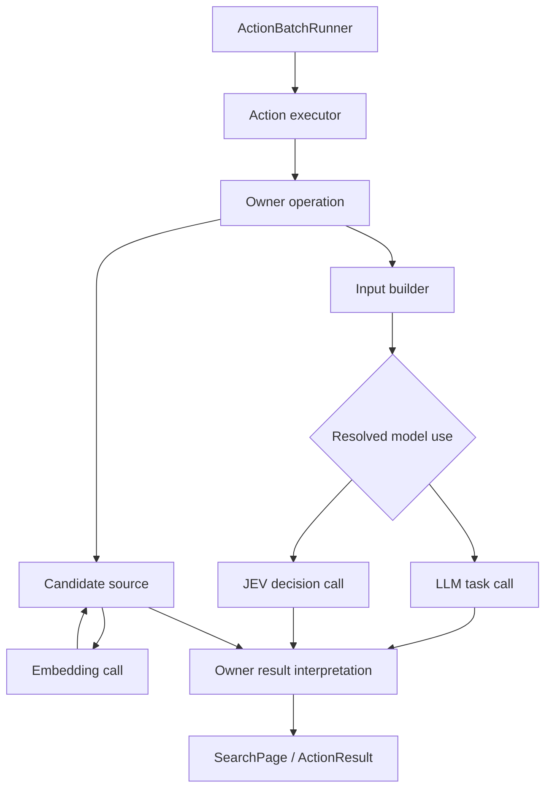

# Action 模型使用与检索统一重构：实施前 Review

日期：2026-09-25。

状态：静态 review 已完成；F1–F12 已与 r2 一并核对并合入 [唯一执行计划](20260924-action-model-retrieval-unification-plan.md)，逐项处置见主计划第 15.4 节。重构已进入准备实施状态，代码实施及验收仍为 `pending`。本文保留原始问题发现、代码证据及第 7 节的维护者确认，不作为第二份实施规格；以下“需要补齐”等措辞记录的是修订前缺口。

代码基线：`5a6842ad64ea5596e1054333919643f833a983aa`（`docs: refine memory inspect and backlink search boundaries`）。已从 origin/main 快进更新并重新阅读 AGENTS.md。该提交相对前次检查增加的是计划、讨论与 JEV 示例；`tinysoul/`、`tests/` 和 AGENTS.md 相对 `f496508` 没有变更。

原始审阅对象：[20260924-action-model-retrieval-unification-plan.md](20260924-action-model-retrieval-unification-plan.md) 的修订前版本；该路径现已承载合并后的主计划。此前 Visualization r4 与 Action model-use proposal 仅作背景，本轮范围以新计划及本次用户要求为准，特别是：不增加 memory.compose、不接入图像生成、不实施 Visualization、不保留旧配置和 Action 别名。

## 1. 结论

**原始审阅结论：方向合理、技术上可行，主要架构选择与项目语义一致；当时计划仍有待补齐的实施契约。** 问题集中在几处正常功能的数据流和职责尚未闭合，并非需要更多安全治理、故障恢复框架或向后兼容层。

值得保留的选择：

1. Action 是业务操作；executor 是实现绑定；模型是实现中的依赖。删除 native/subprocess/llm_action 的并列分类，保留一个 ActionBatchRunner，符合现有真实执行方式。
2. LLM/JEV 的切换发生在 Action 所属语义操作层。该层选取对应输入构造器与输出解释器；模型协议接收准备好的请求，不读取 Context、不提交业务事实。
3. 三种 Search mode 表达检索意图；用户配置决定具体实现和供应商链。Stage2 不直接选择供应商或拼模型请求。
4. Inspect 保持已知入口的确定性披露；语义精炼、反链检索归 Search。Search 结果再由后续明确的 Inspect 读取。
5. 数据、派生索引、Link 解释和来源视图继续由各 owner 持有，kernel 不建设全局知识库。
6. Reflection 继续是同一内核的执行情景，普通 Action 与专属写服务由 profile 明确组合。

需要补齐的是：模型声明与配置绑定、LLM 失败边界、各模式请求定义、Home 全空间候选、Context 原始事实检索、模型排序后的分页、反链范围、Embedding 的共享与 owner 缓存，以及 JEV 如何具体产生可消费的选择结果。

这些都应在本轮设计清楚并实现；分阶段只是依赖顺序，不是交付一套过渡架构。

## 2. 当前实现中的检索与披露行为

| 位置 | 当前行为 | 本轮合理目标 |
| --- | --- | --- |
| Context / Trace / Session | `core.context.inspect` 已共用一个 Action，按 ref 路由；query 在指定范围做确定性定位 | 保留 inspect；新增从原始可读事实中发现候选的 search |
| Home 通用 Skill | Background catalog 提供 metadata；Phase1 通过 Context control 加载 top；Action 读取 resource | 保留渐进披露理念，同时区分持久挂载 Background 与一次性读取 |
| Home search | 只收集 skills top 的 metadata/正文前缀；确定性候选后调用固定 HOME_SEARCH | 全 Home 文本与资源证据候选；通过统一用途绑定选择语义实现 |
| Memory inspect(query) | 全量活动文档上的身份/词法匹配，加可选 Embedding，再分页 | 迁移到 memory.search(query_discovery) |
| Memory inspect(link) | outgoing、backlinks，以及基于全文和 Embedding 的 related 候选 | direct refs 随 inspect；incoming refs 归 backlink search；相似文档仍需明确归属 |
| Memory recall | 按已知 Link 读取完整持久文档 | memory.inspect，增加有界正文分页 |
| Expand describe | server/tool 目录的确定性渐进浏览 | 保留目录披露；无需为了统一而强制改名 |
| Expand search | 枚举有限 tools，LLM 选择已知身份；当前额外包含完整 Context | seed refinement；用户配置 LLM/JEV，默认局部输入 |
| Workspace read/search | 分段读取；literal/regex 行匹配、片段和扫描 coverage | 保留文件操作特点；复用结果与容量语义，不强制建向量库 |
| core.reason/answer、Workspace compose/describe/analyze | 引用读取、输入构造、生成或分析 | 迁移 model use；它们不是 Search，不应被 SearchPolicy 接管 |
| Session organize | Action 提交模型已生成的语义修改，owner 校验证据与事实关系 | 不是独立的嵌套模型消费者，不因本轮抽象自动增加一次模型调用 |

核心实现证据：

- [Action executor registry](../../tinysoul/kernel/action/execution/executor.py) 与 [batch runner](../../tinysoul/kernel/action/execution/runner.py)：按 `backend.handler` 解析 executor，统一调度、超时、hook 和执行事实。
- [旧 LLM Action runner](../../tinysoul/kernel/action/backends/llm_action.py)：同时处理 Skill、Context compose、profile、调用和 ActionResult。
- [已有 LLMTaskRunner](../../tinysoul/llm/execution/task.py)：已经承担 TaskCall → TaskResult 的调用职责，并拥有 Runtime bridge。
- [Home search](../../tinysoul/plugins/home/content/search.py)、[Home engine](../../tinysoul/plugins/home/engine.py)、[Home Background](../../tinysoul/plugins/home/background.py)。
- [Memory catalog](../../tinysoul/plugins/memory/retrieval/catalog.py)、[Memory embedding cache](../../tinysoul/plugins/memory/retrieval/embeddings.py)。
- [Context inspect Action](../../tinysoul/kernel/context/actions.py)、[Session view](../../tinysoul/plugins/session/views/inspection.py)、[Trace owner](../../tinysoul/kernel/context/builtin/trace.py)。
- [Expand actions](../../tinysoul/plugins/capabilities/expand/actions.py)、[Workspace search](../../tinysoul/plugins/workspace/inspection/search.py)。

## 3. 必须修订或明确的设计

以下 P1 表示应在实现相关模块前冻结的契约，P2 表示应在本轮计划中补齐的落地细节；均不是要求扩充边界防御。

### F1 / P1：模型用途声明、绑定和运行观察应分开

涉及原计划 §3.3、§3.5、§4.2、§7。

当前 descriptor 同时包含允许实现、typed builder、当前 target、实际 provider/model。它混合了代码声明、装配结果和每次运行的事实。另一方面，§7 称 Action catalog 是声明来源，§3.3 又称 owner 向 ModelUseRegistry 贡献声明，实施者可能维护两套来源。

还有两个具体缺口：

- 展示的配置只有 `search_policies`，没有可执行的 `bindings` 结构；core.answer、core.reason、Workspace compose 等非 Search 用途如何配置尚未写清。
- Memory 的 `embedding_use` 与 Action model binding 若都可以选择向量用途，会产生两个相互覆盖的选择点。

建议采用一个声明来源和三个明确投影：

| 内容 | 持有者 | 定义 |
| --- | --- | --- |
| 用途声明 | Action/owner 的代码贡献 | 稳定 consumer_id、关联 Action、操作语义、允许实现、输入/输出协议与预算规则 |
| 绑定 | 用户配置，经 generation 校验 | consumer_id → implementation → typed target；LLM target 为 task profile，专用模型 target 为逻辑 use |
| 运行观察 | 单次模型调用 | consumer_id、父 Action invoke_id、调用/尝试身份、实际模型、结果与耗时 |

ModelUseRegistry 只是显式贡献后的不可变查找表，不拥有业务状态。catalog Endpoint 从同一声明和解析后的绑定生成 JSON 投影；不能再在 catalog TOML 中独立重复完整用途定义。实际 builder/interpreter 在操作实现中组合，不要求 descriptor 携带可执行对象和运行结果。

`SearchPolicy` 只决定候选来源、允许的业务参数、是否经过语义阶段及调用哪个已声明 use。它不能再独立保存一份 provider/model/implementation。consumer id、action id、mode 之间只保留真实需要的关联，不让配置重复声明能够从 descriptor 推导的 owner/action。

Memory 的共享索引用途只在 Memory 配置里绑定一次。其 Search 声明引用这个共享依赖，配置页面显示“由 Memory 检索配置提供”，不再提供第二个 Action override。Home 若启用索引，也采用自己的 owner 绑定。LLM/JEV 的选择/重排用途仍是可独立配置的 Action 操作用途。

实现目标是“一次声明、一处绑定、每次调用一份观察”，不是新建三套 registry。

### F2 / P1：复用唯一 LLM 调用器，补齐可选模型阶段的失败边界

涉及原计划 §3.1、§3.2、§6.1、阶段 3/4。

`LLMTaskInvoker` 的职责已大部分存在于 `LLMTaskRunner`。计划应明确是保留或重命名现有调用器，而不是在其旁边新建第二套模型选择、重试、解释流程。

更关键的是，当前 LLMTaskRunner 在模型链耗尽时直接通过 Runtime bridge 抛出控制转移。Home reranker 的 `TaskResult.FAILURE → None` 只覆盖局部结果，不能兑现“供应商调用失败后回到词法结果”。原计划把供应商失败、容量和配置问题一概写成 owner 局部结果，又与 AGENTS.md 三层失败规约不完全一致。

建议在同一 LLM 模块内明确一个可组合的 typed invocation 边界：

1. 协议解释不满足要求，返回局部 TaskFailure。
2. 模型路由耗尽、不可用、输入容量等模块失败，先保留 LLM 自己的有限类型。optional search stage 只处理声明可恢复的种类；不能 `except Exception` 或捕获 Runtime 转移后伪装成功。
3. 未被调用 owner 消费的模块失败，由现有 LLM Runtime 边界转换为 Trap。Phase1/Phase2 和必要的生成调用维持其终止/恢复语义。
4. 配置不可解释、内部不变量破坏不降级为“没找到”；取消永远传播，不触发 provider 切换或词法成功。

这是一条调用管线中的边界拆分，不是新增重试管线。一个简单的明确 outcome/typed exception 边界即可，无须通用失败策略 DSL。

| 情况 | query discovery / backlink 的可选语义阶段 | 必须模型判断的 seed refinement |
| --- | --- | --- |
| 无候选 | 成功空页，不调用模型 | 成功空页，不调用模型 |
| 模型返回合法空集合 | 成功空页 | 成功空页 |
| 输出身份未知/重复、协议无效 | 依 policy 返回原始候选，标记语义阶段失败 | 局部 selection failure |
| 可恢复的模型不可用/路由耗尽 | 原始候选仍有效时返回有说明的降级结果 | 明确的模型选择失败；不返回未经筛选的工具/文档 |
| 配置/不变量失败 | 模块边界失败 | 模块边界失败 |
| 取消 | 传播取消 | 传播取消 |

ActionBatchRunner 继续拥有调度、Action 总时限和 hooks，executor 只执行操作并返回局部结果。§3.1 中“ActionExecutor 负责生命周期、超时、hook”应改正，否则会把 runner 的职责重复下放。

Action 超时统一留在 `runtime.timeout_seconds`；不要同时放到 execution options。迁移时显式处理旧全局 llm_action 的 600 秒默认与域默认的差异，不能删字段后无意把 Workspace 模型 Action 缩短成域的 30 秒。deadline 只从现有 Action control 向下传递，不新增超时线程。

### F3 / P1：三种 Search mode 保留，但请求与过滤规则需要消歧

涉及原计划 §3.4、§5.2、§6.3。

三种 mode 符合已确认的设计，不需要改成由 Stage2 直接选择 Embedding/JEV。然而，当前统一 SearchRequest 的字段几乎全可选，容易产生 query、seed、anchor 同时存在但意义不明的请求。

建议在边界立即解析为三个明确变体：

| mode | 必需输入 | 允许的附加输入 | 不成立的输入组合 |
| --- | --- | --- | --- |
| query_discovery | owner scope；文字 query 或 owner 明确支持的文档 query | filters、policy 允许的 semantic/context、limit | 用 seed_refs 隐式替换 scope；同时宣称做反链 |
| seed_refinement | query/筛选意图；明确 seed 集合或 owner 目录入口 | scope 内的确定性资格条件、允许的 Context、limit | 无种子也无目录范围；用检索相似分数偷偷替代必需 selector |
| backlink_search | anchor_ref、来源 scope | query、filters、可选重排 | 没有 anchor；把相似文档当成反链 |

MCP 的目录入口可以是声明的 server/tool scope，不必伪造普通文件 Link 或要求 Stage2 先枚举所有 tool id。它仍是有限目录上的 refinement。

§3.4 禁止确定性相关性筛选、§5.2 要求 owner 先执行结构化过滤，这两条应明确成：

- **候选资格**：source scope、文档类型、日期、标签、工具可用性等由程序判断，可在任何 mode 先执行。
- **候选相关性**：seed refinement 中由选定的 LLM/JEV selector 判断；不能另做隐蔽 lexical top-k，把 selector 根本没看过的候选说成不相关。

候选太多时，应给出有界 coverage 或要求收紧 scope；不能静默截断后宣称已完成整个种子范围的语义判断。

`default_semantic = policy_default` 不在 `allowed_semantic` 中，也没有给出解析定义。建议默认值直接使用允许选项之一，例如 `none/optional_ranker/required_selector`，或者省略字段表示使用唯一声明默认，避免又加一个无实际用途的别名层。

### F4 / P1：Home 全空间搜索需要定义证据单元与结果身份

涉及原计划 §6.1 和阶段 5。

当前 Home 搜索只是 top 的文本前缀。删去 `skills` 过滤并不能实现“在 nested ref 的局部内容里命中，再返回 top”。必须在本轮做 owner 管理的可搜索证据单元：稳定资源身份、局部文本、内容定位、所属 top（若存在）及来源视图。

需要明确两件事：

1. **召回先于精排。** lexical 与 Embedding 在完整的合格来源范围各自产生候选，然后合并/去重，再进行候选预算和 LLM/JEV 精排。不能先用 lexical 选 top-k，再称后面的 Embedding 为独立语义召回，否则没有词面重合的材料永远无法出现。
2. **top 不是全部资源的唯一身份。** 现有 HomeResourceLink 没有强制唯一父 top；资源可能由多个 top 引用，也可能没有 top 引用。反链命中的 source 更必须精确到实际引用文件。

建议 query discovery 的正常 Skill 结果仍按 top 聚合，携带 `evidence_refs` 与有定位的片段；同一 top 多个片段去重聚合。没有可归属 top 的有效资源直接返回 resource Link，不伪造 Background top。backlink 结果使用真实 source_ref，另提供 entry/top 提示用于导航，不把 top 错当引用发生处。

这一例外涉及用户可见语义，列入文末确认项。

Home 的派生 lexical/reference/embedding 数据均由 Home owner 维护。读 effective Home 时包含 overlay 和删除状态；读 actual 基线时必须明确视图，不混用两者的候选与向量。搜索准备允许 owner I/O，Context render 仍然纯读取。

普通通用 Skill 与 domain/action 局部 Skill mount 继续区分。后者属于特定 TaskPrompt，不因“全 Home 搜索”自动变成 Background 可加载项。计划应直接列出纳入的空间、文本格式、非文本文件的 metadata 行为和明确排除项。

### F5 / P1：Context search 必须搜索 owner 保存的原始事实，而非当前渲染正文

涉及原计划 §5.4。

“当前语境中的事实”容易被实现成搜索压缩后可见文本，从而失去本轮最重要的从无到有召回能力。应明确：

- Trace source 是本轮已结算、可读取的叶子事实及其稳定 ref，包含已折叠内容；不读取尚未完成 Action 的可变内部状态。
- Session source 是本 profile 安装的 SessionView 来源集合、事实与当前已安装的有来源解释；不直接重新扫描“最新全库”。User Turn 的历史集合仍固定，日切仍归档。
- Search 结果区分 fact 与 interpretation，保留原 ref 和必要来源。相同正文被多个 thread 引用不能复制成多条虚假独立事实。
- `scope=all` 只表示本 Context 暴露的 trace/session source，不暗指 Home/Memory/Workspace 全库。
- 从搜索结果 Inspect 时仍沿现有 ref 路由；不能产生只在内存候选数组中有效、无法再次打开的临时身份。

具备完整 Context 的辅助 LLM/JEV 调用，不得调用 `mark_model_consumed` 来解除 inspect 展示保护。当前该操作只在 Phase1/Phase2 调用返回后发生；应保留“决策模型实际收到页面”的语义，而不是“任何模型收到页面”。

Context search 的局部大候选输入应返回收紧范围反馈；只有能由压缩当前 Turn Context 解决的压力，才进入已有 Context recovery。不要让不可缩减的候选 payload 驱动无效的整轮压缩重试。

### F6 / P1：模型排序后的分页必须绑定一次确定结果

涉及原计划 §5.2、阶段 4。

计划承诺稳定分页，却没有说明 LLM/JEV 排序结果在哪里保存。当前 Memory continuation 可以基于确定性查询重新计算结果；加入模型后，每页重新调用会产生不同顺序、遗漏/重复和额外费用。这是正常分页功能问题。

建议区分两类页面：

- Inspect：复用 `infra.continuation` 的 owner/内容绑定，继续沿已知内容分页。
- Search：一次候选准备和模型选择后得到有界、不可变的排序结果视图；continuation 在该视图内前进，不重复调用模型。视图仅保留候选身份、片段/证据及排序，不复制持久正文或另建历史库；生命周期由发起它的 Turn/只读查询 owner 管理，到期返回简单的重新搜索提示。

这些视图可以放在现有 owner 服务的运行态中，不需要持久搜索事务、CAS、快照数据库或恢复状态机。当前 Trace 持有的 Action 返回事实继续是执行证据，不能让 SearchPage 缓存变成第二份事实历史。

分数不能统一假装成相关概率：lexical 分、cosine、JEV score 与 LLM 排名不具备共同数值尺度。公共结果以 `rank` 为主，可选带 typed score/source；跨来源合并按明确的排名融合规则处理。没有数值分数的 LLM 输出可以只有顺序，不填造分数或解释。

`coverage` 至少解释来源范围、候选/已评估数量、截断原因及是否省略某个可选阶段。它不宣称整个库中没有其他相关材料。

### F7 / P1：通用反链的“来源空间”和调用入口尚未确定

涉及原计划 §5.3、§5.4、§6.2。

源文件 A 指向目标 B，这条边属于 A 的 owner。B 的 owner 不一定知道其他空间谁引用了 B。原计划说由协调器跨 owner 合并，但未定义谁调用它、公开 scope 是什么；不能把它藏入只承诺 Trace/Session 的 core.context.search。

推荐一个无需全局图、也无需额外万能 Search Action 的明确方案：

- 每个 owner search 的 scope 表示**引用来源的空间**。anchor_ref 可以是可规范化的外部 owner Link。
- `home.search(backlink_search, anchor_ref=memory:...)` 查的是 Home 来源中指向该 Memory 的边；`memory.search(...)` 查 Memory 来源；Workspace 同理。
- 需要跨空间查全时，Stage2 可在既有 ActionBatch 中调用多个 owner search，结果使用统一 SearchPage。删除本计划中没有明确消费者的“跨 owner 检索协调器”。
- Context 反链查询使用 Session/Trace 暴露的 references/来源关系，并标明关系种类；contains、precedes、成员关系不能默认全部叫 backlinks。

这满足跨空间标准链接的通用反链，不改变 source owner，也不引入持久全局图。若用户要求单次调用全空间查全，则应在实施前另外确认一个明确入口和来源集合，而不是模糊使用 `all`。

公共 Markdown 提取器只负责正确识别链接语法；相对路径基准、规范 Link、片段定位、归档日身份由 source owner 的 resolver 负责。Memory 仍保留 YAML relations/evidence/redirect 的结构化边；不能只索引 Markdown 而删除既有关系来源，也不能用全文字符串包含来代替解析。

跨空间引用提取不应把 Memory 文档的既有持久 MemoryLink 校验强行扩为所有空间事务。可解析的外部引用是派生导航边，内部 Memory 关系的存在性约束保持自己的语义。

### F8 / P1：Memory 的相似文档检索不能被遗漏或混成反链

涉及原计划 §6.2。

原文一处称 inspect 仅返回文档/direct_refs，另一处又保留“有界 related page”；同时把 `related_to`、backlinks 写为一般 filter。当前代码的 related 会对非邻接文档做词法与 Embedding 比较，它不是 direct refs，也不是 incoming edges。

建议完整归位：

- `memory.inspect(link)`：文档内容、直接出口、内容 continuation。
- `memory.search(backlink_search, anchor_ref=link)`：明确的入边来源。
- `memory.search(query_discovery, query={document_ref: link})`：用已知文档构造检索输入，从 Memory 空间发现相似材料；按 owner 规则排除自身和可选重复项。

文本 query 与文档 query 是 query_discovery 的输入变体，无须增加第四种 mode。文档 query 的具体文本由 Memory owner 提取，Stage2 不必把长文档复制进参数，也不应在 inspect 中暗中运行 Embedding。

若决定删除当前 related 能力，需要明确记录为功能删除；不能在“完整迁移”时无声丢失。

### F9 / P1：Embedding provider 链与缓存的职责要完整落到 Home 和 Memory

涉及原计划 §4.2、阶段 2/5。

“同次查询固定 provider，不混合向量”是正确选择。还需要明确这个规则在哪个层级执行：单个 embed HTTP 请求自动切 provider 会破坏同次候选构建的一致性。

建议模型服务提供一次选定 provider 的窄调用会话/句柄；owner 的索引过程在该 provider 上完成所需文档与 query 向量。失败后，owner 为下个 provider 重新构建本次所需向量或使用该 provider 的独立有效缓存。尝试次数受有限 provider 列表和既有 Action deadline 约束，不另建常驻恢复任务。

公共部分是 provider 配置、协议客户端和向量计算工具；Home/Memory 各自持有来源集合、文本抽取、片段身份、缓存生命周期和更新触发。Home 使用 Embedding 已写入本轮方案，因此不能只实现 Memory cache，再给 Home 留一个未实现选项。

缓存身份除 provider/模型/endpoint/维度外，还应覆盖实际影响向量的文本抽取或切片规则；原文内容 digest 继续用于变化判断。key 的明文不进入缓存身份。provider 切换不改变文档事实，也不影响持久 Memory Link。

未启用 Embedding、可选调用不可用可返回 lexical 结果并披露实际策略；引用不存在的逻辑 use、能力类型错配属于配置错误，不能静默退化后显示配置已正常生效。

### F10 / P2：JEV 的 adapter 之外还需要具体的 selector/ranker 方案

涉及原计划 §3.5、§4.3、阶段 4/5。

JEV 定位正确：它判断给定材料中的有限问题，不生成任意 Link，也不能直接代替 Phase2 的 ActionCall 生成。仅写 noul/choice/score adapter 还不能使 Home/Memory/MCP 真正互换 LLM/JEV；必须写出本轮使用的转换规则。

建议本轮候选相关性采用一个可复用的操作实现：

1. owner 提供有限 candidates、query、可选 Context 的一次固定投影和预算。公共操作不访问 owner 私有库。
2. LLM implementation 接收候选身份及证据，返回有序子集；不得返回未知身份。
3. JEV implementation 为每个候选构造 Score 问题，用独立、明确的相关性等级评价候选；返回后由程序筛选、排序、取 limit，并用候选原序作为并列规则。
4. 例如四级规则“无关、仅背景、能支持当前请求、直接解决请求”，项目默认可取 score ≥ 2；这只是需要用代表性样本验收的项目策略，不是供应商保证或正确率阈值。selector 可得到空集合，不能为填满 top-k 强留无关候选。
5. 问题 ID 只作请求响应关联；候选内容、候选身份含义和 query 必须真正进入 state/instructions，不能假定 key 名会被模型读取。
6. choice 适合确实只需一个选项的调用，不能把多工具选择伪装成一个单选；noul 仅在消费者确有门控语义时使用。adapter 支持三种协议，不意味着要人为创造三个 Action。
7. 不根据 confidence 自动切 LLM。绑定选择的 implementation 在本次操作中固定，provider 链仍是相同协议的服务路由。

官方 API 核对：2026-09-25 阅读 [API](https://docs.typesafe.ai/api)、[Score](https://docs.typesafe.ai/primitives/score) 与 [Choice](https://docs.typesafe.ai/primitives/choice)。协议提供 state/model/questions，Score 可以是等级间的小数；问题 ID 不向模型传递语义，confidence 不能理解为事实正确率。本次未调用付费推理接口；仓库已有样例与官方协议足以支撑接口可行性，不能据此宣称实际检索质量已验证。

完整 Context 的使用由 Action/input builder 决定。对 LLM 构造 MessageStack，对 JEV 构造明确的文本/结构化 state；不要把 MessageStack 原对象传给通用模型服务。两者可以消费同一批已安装语境事实，但不必有相同 wire shape。

### F11 / P2：公共 Retrieval 应统一操作，不要堆叠近义 profile 层

涉及原计划 §3.5、§5.2。

candidate_filter、candidate_rank、link_select 都可能变成“候选集合 → 有序子集”的三层包装；context_compose 又与 TaskFactory 的输入准备职责重叠。计划应以真实调用关系裁剪这些抽象，而不是为每个动词创建 registry、profile 和服务。

建议公共能力收敛为：

- owner candidate source：读 scope/种子/引用边，返回有定位的候选与 coverage；
- deterministic eligibility/filter：只处理明确属性和候选资格；
- candidate selection/ranking：LLM、JEV、相似度实现各有 typed request，产出已知候选上的选择/顺序；
- result projection/pagination：统一有界 SearchPage 与 DisclosurePage 的公共部分。

“backlink_probe”是读取关系候选的 source；“link_select”是 selection 的真实用途；“context_compose”是 Action 输入准备，不必再成为 retrieval 操作类型。公共协议可以放 kernel/retrieval，具体 owner 解析和索引仍在 plugins。

Infra 仅拥有纯协议客户端/HTTP/配置工具，不接收 kernel ActionExecution、ContextEngine 或 Runtime ObservationEmitter。模型调用观察和失败桥接由上层调用服务发出，保持既有依赖方向。

### F12 / P2：Endpoint、配置资源和实施阶段需要给出可核对交付物

涉及原计划 §7、§8。

1. §7 的“执行 kind/executor”与删除 kind 不一致。catalog 只输出 executor 绑定与独立 runtime policy；当前模型实现来自用途绑定，实际 provider attempt 来自事件，不写回 catalog。
2. 当前 HTTP 存在 `/v2/config`、`/v2/config/catalog`、`/v2/config/actions`、`/v2/config/reload` 及事件接口；还不存在新计划笼统提及的完整 Home/Memory/Context Search/Inspect HTTP 面。必须列出本轮新增与仅迁移 SDK/Action 的清单，不把前端 r4 的提议当作已实现接口。
3. 检索 Action 的模型调用、只读 SDK 查询和前端浏览不是同一调度入口。明确哪些 HTTP 查询只做确定性读取、哪些允许产生模型请求及使用何种调用生命周期；不新增任意 Action runner 或第二根 Turn 调度器。
4. 模型调用 Observation 复用父 turn/cycle/invoke 等关联；Embedding 可由 SDK 查询触发，父 Action 不是必填。model 级详细记录可按既有协议提供准备好的输入/输出；normal/catalog 不出现大正文或密钥。不要在 §7 一面禁止完整 prompt、一面要求沿用 model 级记录却不解释分层。
5. 阶段 0 不应把 `docs/design` 提前改成已经实现的新事实。冻结契约写在 analysis；对应代码落地时同步 design/endpoint/AGENTS 当前语义。旧名称零命中检查限定生产代码、有效配置和当前契约，不能要求历史讨论、迁移 review 也删掉事实记录。
6. 没有向后兼容不等于无需资源迁移。包内 catalog、模板配置、Action/域 Skill 中的名称和提示、配置编辑 metadata、项目生成器以及相关测试必须一同切换；现有项目配置通过明确转换说明或重新生成处理，运行时不双读旧键。

## 4. 建议冻结的整体结构

图中模型调用均共用 generation 管理的客户端资源；图不表示新增调度循环。一次 Action 仍由同一个 runner 收敛。owner operation 可以组合公共候选操作，也可以直接执行写入、计算或生成；只有真实需要检索的操作使用 retrieval。

语义层次应固定为：

| 层次 | 回答的问题 | 不负责 |
| --- | --- | --- |
| Action catalog | 模型能选择什么操作、参数与策略是什么 | 如何拼供应商请求 |
| Executor | 这个 Action 由哪个实现执行 | 第二套调度/超时状态机 |
| Owner operation | 输入从何而来、模型结果代表什么、是否提交事实 | 管其他 owner 的私有存储 |
| Model use binding | 此用途选哪种实现、引用哪个 task/use | 业务提交、Context 加载 |
| LLM/JEV/Embedding 调用层 | 准备好的输入如何调用模型并返回 typed output | Action 语义、全局检索 |
| Retrieval 公共设施 | 候选、选择、排名、页面如何组合 | 文档事实、全局知识图 |

`execution.executor` 与 model use 不应再互相扮演：模型请求可以是 executor 使用的服务，但不宜重新注册成一种特殊 Action handler，否则又回到“执行方式=模型类别”的旧耦合。

## 5. 本轮应补入计划的消费者清单

以下为建议的稳定用途划分，名字可统一调整，但提交实施前必须选定，不能在不同插件各自发明一套绑定协议。

| 实际消费者 | 操作 | 本轮允许实现 | 语境与来源 |
| --- | --- | --- | --- |
| core.reason | 推理结果生成 | LLM | 当前 Context + Action 局部引用 |
| core.answer | 用户回答生成 | LLM | 当前 Context + 局部引用 |
| workspace.compose | 文档生成 | LLM | 当前语境和经 Workspace 准备的目标/引用 |
| workspace.describe | 描述生成 | LLM | owner 准备的资源输入，明确是否使用 Context |
| workspace.analyze | 分析 | LLM | 已批准的完整引用与任务语境 |
| home.search selection/ranking | 检索精炼/排序 | LLM 或 JEV | Home 候选；按 mode/policy 决定 Context |
| memory.search selection/ranking | 检索精炼/排序 | LLM 或 JEV | Memory 候选；按 mode/policy 决定 Context |
| core.context.search selection/ranking | Trace/Session 检索精炼/排序 | LLM 或 JEV | owner 提供的原事实/解释候选 |
| expand.search selection | 工具目录选择 | LLM 或 JEV | 已知工具候选，默认局部输入 |
| Memory semantic index | 文档/query 向量 | Embedding | Memory 自己的文本集合与缓存 |
| Home semantic index | 资源证据/query 向量 | Embedding | Home 自己的 effective/actual 来源与缓存 |

Phase1/Phase2 沿用 LLM task 配置；它们不伪装成 Action model uses。Memory write/write_daily、Home review、core.ask、Session organize 保持其确定性提交/控制语义，不凭空添加模型阶段。Workspace literal/regex 仍可直接运行，无需专用模型绑定。

## 6. 建议执行顺序与必要验收

1. **冻结契约与两个产品选择。** 补齐用途配置示例、三种请求变体、页面身份/生命周期、错误矩阵、Home 证据模型、反链来源范围；此时只改 analysis。
2. **统一模型声明与调用边界。** ActionExecutionSpec、唯一调用器的可组合失败边界、专用模型 provider/model/use 配置和 JEV adapter；明确 generation close 的唯一所有者。
3. **迁移现有非检索模型消费者。** core 与 Workspace 全部切换；删除 LLMActionTaskRunner，同时保留总时限、Skill mount、输入准备和局部结果的实际语义。
4. **实现公共检索操作及 Home/Memory 来源。** 候选身份、规范链接提取、来源 snapshot、lexical/embedding 融合、LLM/JEV 选择、稳定分页；Home 与 Memory 各自拥有索引。
5. **接入 Context/MCP/Workspace 和三个 profile。** Context 查折叠事实；MCP 用目录种子；Workspace 保留文本范围；Reflection 来源和写权限仍由 profile 提供。
6. **同步 SDK、Endpoint、资源、文档并删除旧路径。** 不做双接口过渡；向前端支持计划交付真实 catalog、配置和事件样例。本轮与前端重构的依赖关系由最终契约确认，不延后本轮核心能力。

必要验收应保护真实行为，不堆重复快照：

- 同一 Action 改绑 LLM/JEV，executor/ActionBatchRunner 不变；两个实现看到对应 typed 输入，输出只含已知候选。
- core.answer 与非 Search 用途可独立配置；Memory Embedding 只有一个绑定源；错误类型在激活前可明确定位。
- Home 仅 nested resource 命中时仍可召回可追溯的入口和证据；共享/无 top 资源按确认规则处理。
- 已折叠 Trace 事实、Session 旧 Turn 正文及解释均可从 query 找回；Inspect 能打开原 ref；辅助模型不会解除展示保护。
- seed refinement 的结构化资格过滤有效，相关性由必需模型判断；无候选与合法空选择都是成功空页。
- Search 第二页不重新调用 LLM/JEV；重复候选不跨页出现；source 变化/视图结束有有限且明确的反馈。
- Markdown 相对链接、引用式链接、Home nested source、Memory 结构化关系与跨空间 anchor 的反链可解释；相似文档不冒充反链。
- Embedding 在 provider 切换后重算或使用独立有效缓存，不混用 query/document 向量；Home 与 Memory 不共享索引事实。
- optional ranker 不可用时保留可解释的候选；必需 selector 失败不伪装成功；取消不触发降级继续执行。
- User/Home Reflection/Memory Reflection 共用模型用途协议，实际来源视图和写权限仍正确。
- 配置 catalog、Action schema、SDK 服务与 Observation 对新模型用途描述一致，无 backend kind/固定 Home profile 残留。

测试顺序沿用规约：聚焦路径 → Fast → Full 与 typecheck。真实 JEV/Embedding 仅 External；本轮实现验收应有小型、人工可判定的检索样本集，检验命中、无关项排除与输入大小，不以 HTTP 通了代替检索能力验收。本次仅做文档静态 review，未运行完整测试门禁。

## 7. 维护者确认结果（2026-09-25）

两项影响对外行为的选择均已确认，最终规则已合入 [唯一执行计划](20260924-action-model-retrieval-unification-plan.md)：

1. **Home 全资源搜索的结果身份。** 普通 Skill 按 top 聚合并附 evidence_refs；其他 Home 内容直接返回目标 resource Link。反链返回真实 source_ref，并可附 top 导航提示。
2. **通用反链的调用范围。** anchor 可以指向其他空间，每个 owner 搜索自己的引用来源；跨来源查询通过多个 owner Action 明确组合，不新增全局检索入口或持久全局图。

已经确认的三种 Search mode、seed refinement 必需 LLM/JEV、Stage1/Stage2 暂用 LLM、Memory search/inspect 改名、无兼容层，以及本轮不做 memory.compose/图像生成，均继续保留，不重复设为待确认项。
