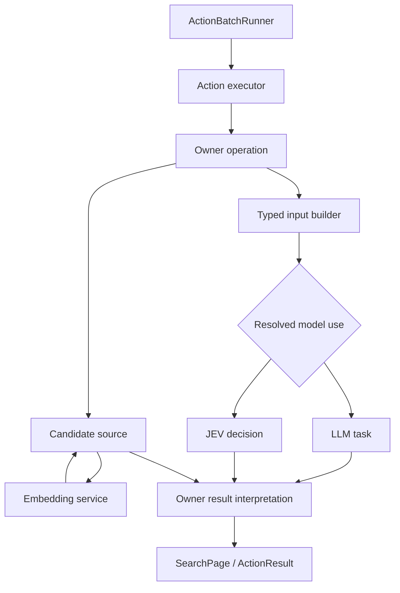

# Action 模型使用与信息检索统一重构执行计划

版本：`2026-09-25 / r2 / consolidated`。

当前状态：`done`。阶段 0–6 已落实，A1–A15、完整本地门禁及代表性真实模型验收均已通过。实现、文档和逐项证据见第 13、16 节。

本文是本轮已归档的唯一执行计划。已合并 [补充 review](20260925-done-action-model-retrieval-unification-review.md)、[analysis r2 输入稿](20260925-done-action-model-retrieval-unification-plan-r2.md) 与本文件上一轮代码复核结论；输入稿和 review 保留历史依据，不再独立维护实施规格或进度。F1–F12 的逐项处置见第 15.4 节。

代码核对基线：`3591f4cff9a11cf3fe9dfef6f4ed243d7b5f1164`（2026-09-25 合并时 HEAD）。相对 review 的 `5a6842ad64ea5596e1054333919643f833a983aa`，`tinysoul/`、`tests/` 和 `AGENTS.md` 没有变更；原代码证据仍适用。analysis r2 与 [chat r2](../../chat/20260925-action-model-retrieval-unification-plan-r2.md) 内容相同，本次补充 review 已完整核对，不再存在缺失依据。

依据：重新加载的 `AGENTS.md`、当前实现与模块设计文档、`docs/chat/04 context-inspect-and-search-design.md`、`docs/example/JevUse/`、此前已确认的讨论，以及补充 review 第 7 节记录的 Home 结果身份与反链范围确认。Visualization r4 和旧 Action model-use proposal 仅解释本轮起因，不覆盖本文。

## 1. 目标、范围与设计决策

本轮在实施 Visualization 重构之前完成后端基础重构，解决两个相互关联的问题：

1. 分开 Action 业务操作、executor 实现绑定、模型依赖与执行承载，使各种模型调用通过清晰的类型协议组合。
2. 统一渐进披露、候选发现、候选精炼和反链检索的语义及公共设施，保留各插件的数据所有权。

不做向后兼容，不保留旧 Action 别名、旧配置双读或第二套调用管线。阶段表示实施依赖顺序，所有本轮能力在本轮完成。

本计划采用的边界：

- Action catalog 只使用 `execution.executor` 绑定实现，不保留 native/subprocess/llm_action 并列类型，不增加 execution.host。
- 同一个 Action 可以使用多个命名模型用途；LLM/JEV 的切换由 Action 所属操作层完成，输入/输出语义由该层管理。
- Stage1/Stage2 保持 LLM 控制协议。Stage2 选择 Search mode、范围、query 和配置允许的业务参数，不选择供应商或任意模型。
- Search mode 为 `query_discovery`、`seed_refinement`、`backlink_search`。seed refinement 必须经过 LLM/JEV selector；其他 mode 可以配置可选的模型阶段。
- Inspect 保持已知入口的确定性读取，不隐式调用模型。Search 不自动打开全部命中，也不自动挂载 Background。
- 普通 Skill 的 Home 搜索结果按 top 聚合；其他 Home 内容直接返回目标 resource Link。反链返回实际引用来源的身份，可附 top 导航提示。
- anchor 可以指向其他空间；每个 owner 搜索自己的引用来源。跨来源查询通过明确的多个 owner Action 组合，不新增全局索引、全局检索协调器或万能 Search Action。
- Reflection 复用同一 Action/model-use 机制。memory.write、memory.write_daily、home.review 保持确定性提交；本轮不新增 memory.compose。
- Embedding 和 JEV 完成真实接入及真实消费者迁移。图像生成、外部 Web Search、Visualization 页面重构不在本轮范围。
- 个人受信主机语义保持不变；不增加通用权限治理、事务日志、CAS 或自动恢复状态机。

## 2. 重构前事实与重构原因（历史基线）

### 2.1 Action 与模型

当前 `ExecutorRegistry` 已经通过 `backend.handler` 查找 ActionExecutor；ActionBatchRunner 统一执行这些对象。subprocess 标记的 Action 也是进程内 executor 调用受控进程服务。因此三种 backend kind 没有表达三种对等的执行协议。

`LLMActionTaskRunner` 同时管理 Action Skill、profile 解析、Context compose、TaskCall、取消和 ActionResult 映射。与此同时，Home 固定调用 `TaskProfile.HOME_SEARCH`，Memory 单独从 `[infra.embedding]` 构建客户端。这使业务输入准备、模型配置和执行类型发生耦合。

`llm.LLMTaskRunner` 已经负责 TaskCall 的模型链、provider 适配、重试与结果解释。本轮重构复用这一调用管线，不再增加功能相同的 LLMTaskInvoker。

### 2.2 检索与披露

| 现有路径 | 当前语义 | 本轮归属 |
| --- | --- | --- |
| core.context.inspect | Trace/Session 共用 ref 路由；query 在已知范围确定性定位 | 保留；补充独立的 core.context.search |
| Home Background / Skill metadata | Phase1 按目录加载 top，resource 由 Action 读取 | 保留加载与读取的不同效果 |
| home.top.search | 只搜索 skills top 的 metadata 和正文前缀，固定 LLM 重排 | 全 Home 来源证据 + 可配置 selection/ranking |
| memory.inspect(query) | 身份/词法和可选 Embedding 候选发现 | memory.search(query_discovery) |
| memory.inspect(link) | outgoing、backlinks 和相似文档 | 出口随 inspect；入边归 backlink；相似文档归 document query |
| memory.recall | 已知 Memory Link 的全文读取 | memory.inspect 的内容分页 |
| expand.describe_* | 目录与已知工具的渐进披露 | 保留名称与目录语义 |
| expand.search | 已知工具候选上的有界 LLM 选择 | LLM/JEV 可配置的 seed refinement |
| workspace.read/search | 范围读取、literal/regex 行搜索 | 保留文件语义，复用引用/coverage/结果投影 |

core.reason/answer 与 Workspace compose/describe/analyze 是生成/分析用途，不应被 SearchPolicy 接管。Session organize、core.ask 和 Reflection 持久写不是独立嵌套模型任务，不因统一抽象增加一次模型调用。

## 3. 稳定架构与职责



图中是一次操作的数据流，不是新增调度循环。原根调度、Turn/Cycle/Phase、ActionBatchRunner、Job 和 profile 生命周期继续存在且各只有一套。

| 层次 | 负责 | 不负责 |
| --- | --- | --- |
| Action catalog | 模型可见业务操作、参数、语义与运行策略 | 供应商 wire request |
| Executor | Action 参数解释、调用 owner、映射局部结果 | 第二套调度/超时/hook |
| Owner operation | 来源读取、输入语义、模型输出解释、事实提交 | 其他 owner 的私有存储 |
| Model-use binding | 为真实用途选择 implementation 和 task/use | Context 挂载和业务写入 |
| 模型调用层 | 已准备请求 → typed output，供应商路由和有限重试 | Action 选择、全局检索 |
| Retrieval 公共设施 | 候选协议、选择/排名、coverage、页面组合 | 持久知识事实与全局图 |

依赖方向保持 `infra → runtime/llm → kernel → plugins/environment → agent → gateway`。专用模型协议/客户端可以置于 infra；它们不导入 ActionExecution、ContextEngine 或 Runtime ObservationEmitter。上层调用服务负责观察和失败解释。

## 4. Action execution 与唯一模型调用管线

### 4.1 Catalog 与执行器

将 ActionBackendSpec 替换为 ActionExecutionSpec：

- `executor`：稳定实现注册键。
- `options`：仅 executor 自身真实需要的参数，不包含 provider、task profile 或通用模型路由。

ActionRuntimeSpec 继续是超时、并行策略、hook 和结果 trace 策略的唯一位置。总时限只配置在 `runtime.timeout_seconds`，不在 execution/options 再保存一次。

ActionBatchRunner 继续拥有调度、Action deadline、hook 和 execution facts；executor 执行具体操作并返回 ActionResult。外部程序仍由 executor 使用 ControlledProcessRunner；跨 Cycle 的监督仍是 Job。

删除 ActionBackendKind、LLM_ACTION 分支、action.llm_action 与 llm_action_timeout_seconds。迁移 catalog 时显式落实原有效时限：旧 llm_action 全局默认不能在删除后无意变成较短的域默认。不要引入替代超时线程或每层重新计时。

### 4.2 请求准备与调用

删除混合对象 LLMActionTaskRunner，分清以下职责：

1. Action 的输入构造器持有本 profile 允许的 Context 读取和 owner 服务，构造 TaskPrompt、Skill 指导、局部资源输入与输出约束。
2. 一个窄的 ActionTaskFactory 复用确实相同的 Skill 挂载、MessageStack 组装和 deadline/cancellation 传递。它不调用模型、不选择业务操作、不提交事实。
3. 保留唯一 LLMTaskRunner 的模型链/provider/解释管线。公开的 typed invocation 边界可供组合操作消费；Runtime-facing run 是这条管线的桥接入口，不是另一套执行器。
4. executor/owner 将 TaskResult 解释为自己的结果，必要时通过所属 owner 的写服务提交，再发刷新 Signal。

从当前 Context 构造输入和从局部来源构造输入，由用途实现明确选择。不能在所有模型服务里统一嵌入 ContextEngine，也不把“完整/局部 Context”变成所有 Action 都必须支持的全局开关。

LLM 的 CallSettings、TaskPrompt 与输出校验继续明确分工：模型输出 token 上限归调用配置；业务可接受的字符数、字段和文档结构归用途解释器。迁移旧 backend.options 的真实消费者，不丢弃原限制或在多个配置位置重复保存。

### 4.3 可组合的失败边界

沿用三层失败，而不是把所有模型失败都转换为普通搜索结果：

- 输出不满足协议是局部 TaskFailure；非法 Action 参数是局部 ActionFailure。
- 模型路由耗尽、输入容量、不可用等先由 LLM 模块自己的有限失败类型表达。调用 owner 可以处理其明确声明可恢复的种类。
- 配置错误、内部不变量和未被 owner 消费的模块失败，在 Runtime-facing 边界通过既有 bridge 转为 Trap。

落实为同一 LLMTaskRunner 中的 typed invocation 边界与薄 Runtime bridge：`invoke(TaskCall)` 执行唯一管线，返回 TaskResult 或抛出模块明确类型的 invocation failure；`run(TaskCall)` 调用该边界并做既有 Runtime 映射。选择型 owner 使用 invoke 并处理有限失败；Phase1/Phase2 等使用 run。二者不各自维护 route state、重试或 provider clients。

取消沿所属生命周期传播，不能被视为 provider 失败后继续切换。候选输入本身过大应反馈收紧 scope；只有压缩当前 Context 确实可解决的容量压力，才进入原 Context recovery。

| 情况 | discovery/backlink 可选阶段 | seed refinement 必需 selector |
| --- | --- | --- |
| 没有候选 | 成功空页，不调用模型 | 成功空页，不调用模型 |
| 合法空选择（select） | 成功空页；纯 rank 对非空输入不能返回空排列 | 成功空页 |
| 输出无效、可恢复的模型调用不可用 | 原候选有效时返回原候选，披露跳过/失败阶段 | 局部 selection failure，不把未经筛选的候选当结果 |
| 配置/内部不变量失败 | 模块边界失败 | 模块边界失败 |
| Action 超时 | 现有 runner 的 timeout 语义 | 同左 |
| 取消 | 传播取消 | 同左 |

候选来源失败与可选精排失败必须分开。至少一个配置内的候选来源成功，才允许返回其已产生的候选并披露其他来源缺失；全部来源失败时返回来源不可用的局部结果或传播未被消费的模块失败，不能把失败解释成成功空页。只启用 Embedding 时，不暗中增补未配置的 lexical；至少一个来源确已执行并产生空集合，才有空结果的依据，coverage 仍说明缺失来源。

可恢复种类由操作显式列举，例如临时连接失败、超时或限流耗尽；认证、请求契约、配置和内部不变量错误不作为普通降级吞掉。模型调用的 timeout 不能吞掉外层 Action deadline。Runtime 异常不能被检索代码捕获后伪装成功；Infra 异常不直接增加 Runtime bridge。必要的调用失败由实际上层 owner 解释。

## 5. 用途声明、配置绑定与装配

### 5.1 一个声明来源

每个真实消费者由代码贡献 ModelUseDescriptor：稳定 consumer_id、关联 Action/owner、操作语义、允许 implementation、目标类型和真实 options schema。具体 input builder/interpreter 由操作实现显式组合，不塞进可序列化 descriptor。

ModelUseRegistry 是 generation 显式贡献后的不可变查找表，不是动态插件发现平台，不保存调用历史。Action catalog Endpoint 从此表和已解析绑定生成投影，不在 catalog TOML 重复定义第二套完整 model-use 信息。

三种数据不能混在一个对象里：

| 数据 | 来源 |
| --- | --- |
| 允许什么用途/实现 | 代码声明 |
| 当前选什么实现/target/options | 配置解析后的绑定 |
| 某次实际调用哪个 provider/model、结果怎样 | Observation |

### 5.2 Action 模型绑定

所有 Action 内模型操作均通过 consumer_id 绑定。非检索用途同样适用，不依赖 SearchPolicy。每个 consumer 恰有一个有效绑定，implementation 是判别字段：

- `llm_task`：target 只能是 task_profile，引用 llm 的任务链。
- `structured_decision`：target 只能是专用模型 logical use，必须为对应能力。
- `embedding_similarity`：仅限声明支持相似度排名的操作，不在 binding 配置 target；从代码声明解析 owner 共享 Embedding 依赖，不接受第二个 use override。
- 索引的 Embedding 是 owner 共享依赖，在 owner 配置绑定，不提供相同用途的 Action override。

实施后的配置结构如下：

```toml
[[action.models.bindings]]
consumer = "core.answer.generate"
implementation = "llm_task"
target = { task_profile = "llm_action" }

[[action.models.bindings]]
consumer = "home.search.select"
implementation = "structured_decision"
target = { use = "decision_main" }

[[action.models.bindings]]
consumer = "home.search.rank"
implementation = "llm_task"
target = { task_profile = "llm_action" }
```

输出 token 等实现相关选项若可配置，放在该 binding 的 typed options，由声明校验；Action 成果的格式/大小仍归 owner。没有声明的 option 不接受。多个用途可以引用同一 task/use，无须复制模型目录。

取消固定 HOME_SEARCH 特殊路径。现有同名 task 配置可以作为普通用户 task 存在，但没有代码硬编码特权；包内默认绑定使用普通配置项。所有实际默认绑定在生成配置中明确列出，运行时不保留旧 default/override 解析链。

### 5.3 SearchPolicy 与用途绑定分工

SearchPolicy 按 Action 和 mode 配置：候选来源、语义阶段默认/允许值、Context 默认/允许值、候选/输出预算。它不存 provider 或重复的 implementation/target。

Action 的声明确定该 mode 中 `rank/select` 对应哪个 consumer_id。例如 Home rank 对应 home.search.rank，必需 selector 对应 home.search.select；LLM/JEV 由各自 binding 决定。

```toml
[[action.models.search_policies]]
action_id = "home.search"
mode = "query_discovery"
candidate_sources = ["lexical", "embedding"]
default_semantic = "rank"
allowed_semantic = ["none", "rank"]
default_context = "none"
allowed_context = ["none", "current"]

[[action.models.search_policies]]
action_id = "home.search"
mode = "seed_refinement"
default_semantic = "select"
allowed_semantic = ["select"]
default_context = "current"
allowed_context = ["none", "current"]
```

默认值必须属于允许值，不使用 policy_default 等未定义别名。Stage2 的 schema 只呈现该 Action/profile 真正支持的有限 mode/semantic/context 参数。selector 固定为必需的 Action，可以省略不提供选择价值的 semantic 字段。

semantic 的操作含义固定：`none` 跳过模型相关性阶段，`rank` 只排序，`select` 返回相关的有序子集；discovery/backlink 可按声明和 policy 开放后两者，seed refinement 只允许 select。不增加可编程步骤链。绑定实现变化时，policy 与真实输入能力一并校验，例如 `embedding_similarity` 只使用 query/候选文本，不支持 `context=current`；不接受后默默忽略 Context。

允许的模式、semantic、context、来源和 filters 的投影与 Action 参数归一化必须使用同一份解析结果；修改 binding 后不保留过期 schema。默认值可由 Action 补齐，但进入内部 typed 请求前必须已明确。模型只见业务选择，provider/implementation 仍只在配置和运行观察中出现。

模板默认 discovery/backlink 可使用确定性候选、不启用精排；seed refinement 默认 LLM。Home/Memory 的 Embedding 来源在存在明确可用 owner binding 后才允许配置启用。迁移现有已启用 Embedding 的项目时，应同时配置 owner binding 和对应候选来源，不能静默关闭已有能力。

### 5.4 装配和生命周期

1. 加载配置和代码声明，验证 consumer、mode、实现、target 与 options。
2. generation 构造共享 LLM 与专用模型客户端/路由；每份 I/O 资源有且只有一个 close owner。
3. plugin 构造持久 owner、派生索引和局部用途实现；共享模型客户端不归 Memory/Home 各自重复关闭。
4. profile 注入明确的服务/来源和 Turn Context；factory/候选操作只能看到 profile 已授予能力。
5. SDK 服务仍绑定 generation/day lease，过期对象按原协议失效。

复用现有 ServiceRegistry 与 PluginProfileExtension/PluginGeneration，不为用途、模型、检索各增加一个插件生命周期平台。未选择的专用模型条目可以保存且不连接；选中的绑定必须具备有效配置和至少一个可路由 provider，启动验证不进行付费试调用。

“选中”包括已启用 consumer 和 policy 允许调用的语义阶段，不能因为默认 semantic=none 就跳过一个仍允许 Stage2 选择的 rank 依赖。未接入可用操作的目录条目仍校验自身结构，但不要求连接或运行凭据。visibility 不能授予 owner 服务或绕过既有支持性校验。

## 6. 专用模型服务

### 6.1 Provider → Model → Use

`llm` 保留通用生成模型、task chain 和 provider 配置。专用模型在 `infra.model_services` 声明 provider、logical model 和 logical use：

- provider 保存 adapter、endpoint、凭据环境变量、代理、超时和有限重试参数。
- logical model 保存能力类型与有序 provider bindings；binding 指定供应商实际模型名称。
- logical use 表达稳定能力意图，一对一引用一个 logical model；不建立专用 model chain。

两种能力为 `embedding` 与 `structured_decision`。暂不创建无消费者的 image runner/schema 分支；新增模型类别不依赖 Action backend 类型，因此无需预留空实现。

```toml
[[infra.model_services.providers]]
id = "typesafe_main"
adapter = "typesafe_system_one"
base_url = "https://api.typesafe.ai/v1"
api_key_env = "TYPESAFE_API_KEY"
enabled = true
timeout_seconds = 30
max_retries = 2

[[infra.model_services.models]]
id = "jev_main"
kind = "structured_decision"
provider_bindings = [
  { provider_id = "typesafe_main", model = "jev-latest" }
]

[[infra.model_services.uses]]
id = "decision_main"
kind = "structured_decision"
model_id = "jev_main"
```

Embedding 使用同一目录结构，自己的 adapter 与 typed 参数声明 dimensions/batch 等能力。provider 顺序是配置顺序。专用服务不通过 LLM provider alias 交叉引用；公共 HTTP/连接配置可复用，协议适配仍各自明确。

### 6.2 Embedding 路由与 owner 索引

删除 `[infra.embedding]` 的单客户端路径。Memory 与 Home 分别保存一个可选的共享用途引用：

```toml
[memory.semantic_search]
embedding_use = "embedding_main"

[home.search]
embedding_use = "embedding_main"
```

二者可使用相同模型服务，但不共享文档索引事实。Memory 缓存归 Memory；Home 的文本证据/片段缓存归 Home。公共部分是客户端、向量工具与有限 provider route。

一次检索尝试固定 provider：

1. 模型服务提供选定 provider 的窄会话/句柄，单个 embed 调用内部不偷偷切换 provider。
2. owner 用该 provider 的有效缓存或新调用完成所需 document/query 向量。
3. 失败时可对下一个 provider 重新执行本次向量阶段，或者使用该 provider 独立有效的缓存；不能把不同 provider、模型或维度向量拼接计算。
4. provider 列表和 Action deadline 限制尝试，不增加无限重试或后台恢复。

缓存身份包括模型配置、adapter、provider、实际请求模型、endpoint、维度和文本抽取/切片规则；条目绑定来源内容 digest。凭据不进入缓存身份。缓存可删除重建，不是持久 Memory/Home 事实。

显式未启用或可选调用不可用，可以保留 lexical 候选并披露实际策略。不存在的 use、错配类型等属于配置错误，不能显示为已正常应用。

### 6.3 JEV 协议与真实选择操作

采用窄异步 `typesafe_system_one` HTTP adapter；使用现有通用 HTTP 依赖/设施，不因示例脚本而引入同步阻塞调用或另一层 SDK 重试。请求/响应在 adapter 边界转换为明确类型。

协议支持 noul、choice、score。它们分别是有限判断、单选、有序等级评分，不生成自由文档、query、任意 Link 或完整 ActionCall。依据为仓库 JevUse 和官方 [API](https://docs.typesafe.ai/api)、[Score](https://docs.typesafe.ai/primitives/score)、[Choice](https://docs.typesafe.ai/primitives/choice)，核对日期 2026-09-25。

本轮必须实现候选选择操作的 LLM 与 JEV 两个真实 implementation：

- owner 提供候选身份、证据、query、可选的一次固定 Context 投影和预算。
- LLM select 返回已知身份上的有序子集，可附有界理由；LLM rank 返回送入排名阶段的全部候选身份的排列。漏项、重复项和未知身份属于该操作的局部输出协议失败。
- JEV 对每个候选构造 Score 问题；候选信息和 query 放入 state/instructions，问题 key 只作响应关联，不能依赖 key 名向模型传递语义。
- 项目默认相关性等级为“无关、仅背景、能支持请求、直接解决请求”，对应 0–3；Score 是可取小数的概率加权值。selector 保留 score ≥ 2 的候选并降序排列，稳定原序作为并列规则；这是项目规则，不是正确率保证。rank 保留送入该阶段的全部候选并排序，不套 selector 的排除阈值；返回页的 limit/预算与模型相关性排除分开统计。
- 合法空选择是成功结果。JEV choice 不用于伪造多选；noul 仅用于实际需要二值判断的 typed 操作，不为它人为增加 Action。
- adapter 校验问题身份、响应类型、数值范围和已知候选映射；业务相关性由操作层解释。
- 不因 confidence 较低自动跨 implementation 调 LLM；同一次操作只执行配置选定实现，其 provider 链仍可有限切换。

候选选择输入超过容量时，返回需要收紧 scope 或明确局部覆盖的信息；seed refinement 不静默删掉未评估候选后宣称全范围筛选完成。不增加隐式多轮模型代理。

## 7. Retrieval 公共协议与三种 mode

### 7.1 公共设施的范围

kernel/retrieval 只包含真实复用的协议和组合能力：

- owner 候选来源协议、候选身份/证据、SearchCoverage、SearchPage。
- 明确属性的资格过滤。
- typed 候选 selection/ranking；实现可以使用 LLM、JEV 或相似度，但没有 UniversalModelRunner。
- 去重、排名融合、容量、页面投影和 continuation。

不为 candidate_filter、candidate_rank、link_select 再各建一套 registry/profile。backlink 是关系候选来源；context compose 是 Action 输入准备。名称相似的步骤按真实数据流复用，不建立通用查询 DSL 或用户可编程 pipeline。

owner 把本地 Link/Ref、metadata、可读证据和来源定位转换为候选。公共层不能解释 Home 路径、Memory 文档语法或 Session 注释含义。

### 7.2 请求变体

动态参数在入口转换为三个明确类型；不要让 query/seed/anchor 全可选的字典在内部流转。

| mode | 必需内容 | 可选内容 | 候选来源 |
| --- | --- | --- | --- |
| query_discovery | 明确 scope；文本 query 或 owner 支持的文档 query | filters、允许的 semantic/context、limit | 合格来源上的 lexical/regex/embedding 等 |
| seed_refinement | 筛选意图；已知 seed 集合或 owner 声明的目录入口 | 资格过滤、允许的 Context、limit | 种子所张成的有界内容/目录空间 |
| backlink_search | anchor_ref、来源 scope | query、filters、允许的 semantic/context、limit | 来源 owner 保存的 incoming reference 候选 |

query_discovery 不接受同时改变意义的 seed/anchor；backlink_search 不能缺少 anchor；seed_refinement 不能没有种子或目录范围。

所有 scope/filter 由 owner 声明并验证，不支持的字段拒绝。MCP 的 server/tool 目录是合法 seed 范围，无须伪造文件 Link。

### 7.3 资格与相关性

确定性资格过滤包括显式范围、类型、日期、标签、工具可用性等，可以用于全部 mode；它只定义请求中哪些对象有资格进入候选集合。这里延续已确认的“seed refinement 不做确定性相关性筛选”：不根据 query 的词面匹配、相似分数或隐藏规则先排除候选。seed refinement 没有显式资格条件时不另加过滤。种子范围本身、去重和输入预算也由程序处理，预算截断必须披露未评估范围。

seed refinement 中的相关性必须由 LLM/JEV selector 判断，不能先用隐藏 lexical top-k 把候选删掉再说模型已评估全部范围。selector 是必需步骤，但空候选无需调用。

discovery 的 lexical 与 Embedding 在同一合格来源范围独立产生候选，先合并去重再限定精排输入；不能先 lexical 截断后声称提供了无词面重合的语义召回。融合采用基于排名的明确规则，避免直接相加不同尺度分数。默认采用倒数排名融合，常量和来源预算由公共实现集中定义，owner 只提供真实需要的来源权重；不要求 Stage2 设置算法参数。

backlink 的候选必须先有真实入边。可选语义步骤只能筛选/排序这些来源，不能把相似文档补进反链集合。只提供 anchor、没有 query 且 context=none 时，合法操作是按 owner 稳定原序枚举反链；不能把 anchor 字符串冒充相关性 query 后调用模型。显式请求 rank/select 时必须具备该实现所需的判断输入（query，或实现明确支持且实际存在的 current Context），不足时返回参数反馈。

### 7.4 上下文规则

重排默认 `context=none`；seed refinement 默认 `current`，MCP 默认 `none`。policy 可收紧允许值；Stage2 只能在允许范围选择。

`current` 指该操作开始时已安装 Context 的一次固定投影。LLM 用 MessageStack，JEV 用明确序列化的 state；不是让通用客户端读取 Context，也不是复制一个新的语境 owner。

辅助 LLM/JEV 调用不解除 inspect 展示保护。只有 Phase1/Phase2 等实际决策模型请求收到页面并返回，才沿现有 mark_model_consumed 语义允许折叠。容量拒绝不解除保护。

## 8. 页面、分数与渐进披露

### 8.1 Inspect

输入是稳定 Link/Ref、内容范围或 continuation；输出是该入口的有界内容、直接出口、来源和继续读取线索。query 若支持，只在明确入口内确定性定位。

Inspect 不查询反向索引、不进行语义相关判断、不自动递归读取子 ref。Home/Memory 的持久 Background 挂载仍通过 Context load/evict；Action inspect 的读取结果进入 Trace，是一次可追溯返回。

Trace/Session 继续共享 DisclosurePage。Home/Memory 等复用公共引用/continuation/容量规则，同时保持自己的 typed 内容；不把资源文件和 Session ref 变成同一种持久结构。

### 8.2 SearchPage

公共结果至少表达：来源 scope、mode、有序候选、片段/证据定位、coverage、实际使用的阶段、continuation。候选主身份必须能通过对应 owner 再次打开。

排序主协议是 `rank`。数值 score 是可选 typed 信息，标明 lexical/cosine/JEV 等来源；LLM 只有顺序时不伪造概率或数值。模型没提供解释时，不自动再调用模型生成理由。

coverage 明确候选范围、扫描/候选/已评估数量、截断/省略原因及阶段降级。结果为空不等价于整个资源空间不存在相关内容。

请求 limit 限制本次最终结果视图保留的候选数，候选输入预算与单页字符预算分别管理。先完成声明范围内的选择/排序，再应用结果 limit；continuation 只遍历已保留结果，不扩展候选空间或重新精排。coverage 区分扫描未覆盖、候选未评估、结果 limit 舍弃和本页尚未展示；无法获知全空间总数时不伪造精确计数。

### 8.3 Continuation 与生命周期

Inspect 复用 infra.continuation 的 owner/内容绑定。Search 排序后形成一次有界不可变结果视图，后续页面只在这份结果中前进，不重新调用 LLM/JEV。

视图由发起搜索的 owner 运行态持有，保存候选身份、排序和有界证据，不复制持久正文，不写第二份历史。Action 查询视图受 Turn 生命周期约束；SDK 只读查询受 generation/服务查询视图约束，owner 只保留有界数量的视图，显式关闭、回收或失效后提示重新搜索。

来源变化不改写已生成的页面顺序；Inspect 打开资源时仍读取 owner 当前允许的内容，若资源不可读则返回正常的局部反馈，不承诺磁盘历史快照。页容量、owner、查询/视图身份通过 opaque continuation 绑定，不向模型暴露内部版本协议。

Action 的视图还绑定发起 Turn/profile；SDK 视图绑定服务查询范围以及适用的 generation/day lease，不能跨日继续使用仅绑定 generation 的旧 Workspace/Session 视图。续页入口只使用既有 view/continuation，不重新接受会改变 query、scope、semantic 或 context 的参数；参数冲突要求新建搜索。coverage 的阶段与评估数量属于该次视图，翻页不累计成新的模型评估。

## 9. 反链与引用解析

反链是实际引用边 `source_ref → target_ref` 的入边，边归 source owner。公共 Markdown 提取负责语法；source owner 负责相对路径基准和引用发生的位置/日期，目标的规范身份、top/resource 映射与 redirect 规则仍由目标 owner 解释。跨 owner 只注入所需的窄只读身份解析能力，不让来源模块复制另一 owner 的 codec 或访问其私有存储，也不为此建立全局检索协调器。

目标资源与其片段分别保存：无 fragment 的 anchor 查询该资源及其局部片段的入边；带 fragment 的 anchor 查询目标 owner 能规范化匹配的该片段入边，不把无法解析的片段猜成其他位置。结果保留实际 source_ref 和目标定位证据。Workspace 等日级身份必须带上所属来源所绑定的日期，不能在日切后按新一天重新解释旧边。redirect 解析保留原始引用证据，不把跳转推导写成新的源文档引用。

实现应识别标准 inline/reference-style Markdown link，避免把代码块内示例或任意字符串包含误作链接。普通网页链接不进入本轮本地资源反链检索。

各 owner 的查询范围固定：

- home.search 的 backlink mode 查 Home 来源，可接受 memory/workspace 等有效 anchor。
- memory.search 查 Memory 来源，仍保留文档 YAML relations/evidence/redirect 等明确结构化边。
- workspace.search 的 backlink mode 查 Workspace 的可解析 Markdown 来源；使用 owner 当前来源清单和有界扫描/派生索引，不建立 embedding。
- core.context.search 查本 Context 暴露的 Trace/Session 引用与来源关系，标明关系种类。contains/precedes/thread membership 不自动全部视为 backlinks。

跨空间目标引用作为派生导航边，不要求在源 owner 复制目标资源或建立跨文档事务。Memory 自身持久 MemoryLink 的存在性/redirect 校验仍保留原语义；不能把外部资源导航强行纳入同一个写入事务。

查询多个来源使用多个明确 owner Action；同一个批次可以复用已有并行执行机制。`scope=all` 的含义始终由当前 Action 的来源 owner 定义，不表示跨全项目的隐式搜索。

例如 Home 资源 A 引用 Memory 文档 B，`home.search(mode=backlink_search, anchor_ref=B)` 返回 A；`memory.search` 对同一 anchor 只返回 Memory 来源。查所有已支持空间时，由 Stage2 显式安排这些 owner 搜索，再沿返回的 source_ref Inspect；不能因目标属于 Memory 就只查询 Memory 的来源索引。

## 10. 各插件目标设计

### 10.1 Context / Session / Trace

保留 core.context.inspect，新增 core.context.search。后者支持 trace/session/all，并可发现已折叠内容：

- Trace 来源是本轮已结算、可读取的原始叶子事实与稳定 ref，不是只读当前渲染文本，也不是扫描未完成 Action 内部状态。
- Session 来源是本 profile 安装的 SessionView 固定历史集合、事实与当前已安装解释；User 的 prior-Turn 集合不因搜索重新扫描而变化。
- fact/interpretation 明确区分；共享正文按原事实 ref 去重，解释保留来源。
- query discovery 支持确定性候选和可选精排；seed refinement 用 selector；backlink 读取实际引用/来源关系。
- `all` 只合并 trace/session；Home/Memory/Workspace 使用对应 Action。
- 搜索不 seal_trace、不提前 completion、不重编号已结算 Action。Session 日切归档和 Organize 的提交语义保持不变。

搜索结果的 ref 必须仍能由 core.context.inspect 打开；同一分页不重复模型调用，当前语境压缩不凭空使未变事实身份失效。

### 10.2 Home

删除 home.top.search、home.resource.read，替换为 home.search、home.inspect。保留 Home 实际基线与 overlay 所有权。

搜索覆盖 agent/skills 中可读的 top/resource 内容；domain/action 局部 prompt mount 不自动加入全局搜索或 Background 目录。文本资源建立有定位的证据单元；非文本资源仅纳入已有 metadata，不暗中运行转码或模型解析。

结果身份采用已确认的规则：

- 普通 Skill：有明确所属 Skill top 的内容按 top 聚合，返回 top Link、摘要和 evidence_refs/片段；多个片段不重复生成同一 top 候选。
- 其他 Home 内容：返回实际目标 resource Link，即使其对应文件同时存在 Background top 身份，也不强行作为 Skill top 聚合。
- 无所属 Skill top 的有效资源：返回 resource Link，不造 top。
- backlink mode：主身份是发生引用的真实 source_ref；可附 Skill top 等导航信息。没有实际引用的聚合入口不冒充入边来源。

所属 Skill 由 Home owner 的资源布局确定：有效 `skills/<skill>/SKILL.md` 及该 Skill 目录内的资源归同一 top；跨 Skill 链接只建立引用关系，不自动把目标资源复制到引用方的内容集合。独立共享资源没有有效所属 top 时按 resource 返回；位于某个 Skill 内、被其他 Skill 引用的资源仍归实际所属 Skill。这样既覆盖共享/无 top 资源，又不引入第二份归属 manifest。

top 和 resource 对同一文件的身份由 Home owner 明确映射；反链规范化按真实资源身份处理，并保留必要的 top 导航提示，避免因两种入口漏查。

owner 维护 lexical/reference/可选 Embedding 的来源与缓存，支持读取 nested resource 的局部证据。普通搜索使用 effective Home；Home Reflection 的 baseline/diff 明确使用 actual/effective 各自视图，不混用缓存。普通 User 不获得 actual 写权限。

Skill metadata 仍为 Phase1 提供发现入口，load/evict 负责 Background 常驻选择；home.inspect 负责已知 top/resource 的一次性分页读取。两者读取同一 owner，不维护两套内容事实。

### 10.3 Memory

删除 memory.recall 与旧 memory.inspect(query) 混合接口：

- memory.inspect：已知文档的内容分页与 direct_refs。没有反链、语义相关页或隐式 Embedding。
- memory.search(query_discovery)：文本 query，或 `query={document_ref: ...}`。文档 query 由 Memory owner 构造检索输入，用于发现相似文档，并按规则排除自身；无需第四种 mode。
- memory.search(seed_refinement)：已知 refs 的必需模型选择。
- memory.search(backlink_search)：Memory 来源中指向 anchor 的真实入边，可加 query/filter/rank。

类型、活动状态、日期等支持范围由 Memory 声明；持久 Link、redirect 与文档事实仍由 owner 管理。lexical 与 Embedding 独立召回后融合，语义排名不能只重排 lexical 已截断的小集合。

活动 Memory.md 仍由 memorize patch。只有 Memory Reflection 获得 write/write_daily 服务，单个完整文档原子提交。不新增 compose、preview、批次事务或 CAS。

### 10.4 MCP Expand

describe_servers、describe_tools 保留为目录披露。expand.search 是 server/tool 目录范围上的 seed refinement；无需让 Stage2 先知道每个工具身份。

默认不附完整 Context；输入含 query、server scope、工具身份/描述及选择确实需要的参数信息。LLM/JEV 输出均映射回目录中已知工具身份，未知/重复身份是局部选择失败。

超容量由 Agent 收紧 server/tool scope，保持当前明确反馈；不递归启动子代理穷举工具。结果尽量提供完整定义，容量不足时返回身份及 describe_tools 入口，不伪造残缺 schema。工具定义仍属于 Trace 的工具返回，不常驻 Working。

### 10.5 Workspace

workspace.read 保持 Link/范围的渐进读取。workspace.search 保留 literal/regex、目录/文件范围、支持的 metadata filters、行位置和片段；这些属于 query_discovery 的 owner 具体参数。

本轮增加标准 Markdown 的来源反链查询能力，以落实跨空间 anchor 语义。它复用 Workspace 来源清单和有界扫描，可保存可重建派生边，不增加持久知识图。

Workspace 不提供没有实现的 seed refinement 选项，不建立默认 Embedding/JEV 检索。需要模型分析已有资源时使用已有 analyze 等真实 Action，按 model use 迁移。

## 11. 模型消费者与接口清单

### 11.1 消费者

| consumer_id | 实现范围 | 输入准备/结果 owner |
| --- | --- | --- |
| core.reason.generate | LLM | core 当前 Context、局部引用、结构化推理结果 |
| core.answer.generate | LLM | core 当前 Context、局部引用、回答输出 |
| workspace.compose.generate | LLM | Workspace 目标/参考与当前任务语境，owner 提交 |
| workspace.describe.generate | LLM | Workspace 资源与任务语境，owner 描述提交 |
| workspace.analyze.generate | LLM | Workspace 已准备完整引用与分析任务 |
| home.search.rank / select | rank 支持 LLM/JEV/相似度；select 支持 LLM/JEV | Home 候选与已配置 Context |
| memory.search.rank / select | 同上 | Memory 候选与已配置 Context |
| core.context.search.rank / select | LLM/JEV | Trace/Session 来源 |
| expand.search.select | LLM/JEV | 工具目录与 query |
| Memory semantic index | Embedding，owner 唯一绑定 | Memory 文档/查询/缓存 |
| Home semantic index | Embedding，owner 唯一绑定 | Home 证据/查询/缓存 |

rank 的相似度实现引用 owner 已绑定的 Embedding 用途，不另配一套向量模型。若选择相似度 rank，binding 的 implementation 为 `embedding_similarity`，配置不包含 target 字段；解析结果的 target 由 descriptor 指向 owner dependency，必须有该 owner dependency 才能激活。这是具体排名操作实现，不是通用 EmbeddingAction。

所有消费者有明确输出协议和预算；没有实际消费者的 descriptor 不注册。Phase1/Phase2 沿用 llm task 配置，不伪装为 Action。

### 11.2 SDK 与 HTTP 范围

SDK 的 Home/Memory/Session/Expand/Workspace owner 服务按本计划更新实际支持的读取与 Search/Inspect 协议，仍遵守 generation/day lease。当前没有独立的 SDK ContextService；不据此新建一个拥有或读取任意活动 Context 的门面。core.context.search 的 trace/session/all 组合属于所属 Turn；SDK Session 查询只使用显式取得的 Session 来源视图，不读取活动 TurnTrace。Action 调用和 SDK 调用复用各自 owner 的候选、选择与披露操作，不各建检索实现。

SDK 直接查询没有活动 Turn Context，模型上下文参数只能为 `none`，局部 query/候选属于普通任务输入；`local` 不作为未定义的新 context 枚举。省略 context 时按 SDK 入口的 none 默认归一化，并校验 policy 允许 none；要求 `current` 的查询通过所属 Turn 的 Action 完成。SDK 模型查询可以是有取消/查询视图生命周期的只读服务调用，不创建第二根 Turn 或隐藏循环。其模型 Observation 没有父 Action 时保留独立 operation 身份，不伪造 invoke_id。调用失败在 SDK 服务边界返回局部结果或明确的服务异常，不把没有活动 Runtime frame 的 SDK 调用转换成 Turn Trap。

本轮 HTTP 的交付清单：

| 现有 Endpoint | 本轮变化 |
| --- | --- |
| GET /v2/config | 返回新配置当前状态，不包含旧 action.llm_action/infra.embedding |
| GET /v2/config/catalog | 新绑定、专用模型目录和 SearchPolicy 的编辑/schema 描述 |
| GET /v2/config/actions | execution.executor、用途声明/绑定、真实 mode 能力、runtime policy；不保留 backend kind |
| PATCH /v2/config | 新配置的类型化解析与一致性校验，删除旧键的运行时兼容 |
| POST /v2/config/reload | generation 激活校验、资源生命周期和失败语义更新 |
| 现有 Turn 与事件接口 | 承载新 Action schema/结果以及模型调用观察 |

本轮不引入 `/v2/actions/run`。此前 Visualization 支持计划中的全新 Home/Memory 浏览页面 HTTP 接口、批量 apply、运行方案等仍属于其明确的独立工作范围；本文不把这些提议误记为现有接口。检索的实际能力在本轮通过 Action 与 SDK 完整交付，当前公开 Endpoint 的配置/事件契约同步更新。

### 11.3 观察

模型调用观察记录 consumer、implementation、target、实际 provider/model、attempt、耗时、usage 与结果/有限失败原因；父 turn/cycle/invoke/task 关联沿用现有语义。LLM 不新增重复 model_call_id 别名来复制 task_id；专用模型调用提供等价的稳定调用身份。

normal/verbose 输出有界摘要；model 分级可以记录已准备的模型输入/输出，遵守现有显式开启语义。catalog 不保存实际最近一次 provider 结果，不返回完整 prompt。向量不直接输出，Embedding 观察只包含数量、维度和路由摘要。

Observation 是旁路，sink 失败不改变业务；它不成为索引更新、模型路由或 Session 事实的所有者。

## 12. 代码组织与删除清单

优先调整已有模块，不为每个动词新增文件或基类：

- `kernel/action`：ExecutionSpec、用途声明/绑定解析、ActionTaskFactory、runner 集成。
- `llm`：复用 TaskCall/TaskResult、唯一模型执行管线与可组合的模块失败边界。
- `infra` 的 model_services 相关代码：专用模型配置、typed protocol、HTTP adapter 与有限 provider route；无 Runtime bridge。
- `kernel/retrieval`：候选/页面/coverage、资格过滤、typed 选择和排名组合；具体 owner 解析不进入此目录。
- `plugins/*`：各自 source、Link/Ref 规范化、证据、索引、操作实现与 profile 贡献。
- `agent/composition`：显式收集声明、generation 模型资源与 plugin 装配；不复制调用算法。
- `gateway/endpoint`：更新现有配置/目录/事件协议映射。

| 删除/替换 | 目标 |
| --- | --- |
| ActionBackendKind / ActionBackendSpec / backend.handler | ActionExecutionSpec / execution.executor |
| action.llm_action、旧 default/override、隐式超时分支 | 显式 bindings + Action runtime |
| LLMActionTaskRunner | 输入准备 + 唯一 LLMTaskRunner 调用边界 + owner 结果解释 |
| 固定 TaskProfile.HOME_SEARCH 代码路径 | 普通用途配置引用 |
| infra.embedding 及 Memory 独占共享客户端创建/关闭 | generation 专用模型服务 + owner 索引依赖 |
| home.top.search / home.resource.read | home.search / home.inspect |
| memory.recall / memory.inspect(query) | memory.inspect / memory.search |
| 没有入口的跨 owner 协调器提议 | 多个 owner 搜索的显式组合 |

包内 catalog、配置模板、Action/domain Skill 中的调用名称、项目生成器、配置编辑元数据与测试一起迁移。现有项目配置提供明确转换说明或重建步骤，运行时不双读旧键。历史聊天、review 与归档文档允许保留旧名称作为事实记录。普通用户 task_profile 的字符串名称（例如 llm_action）不等于被删除的 backend/config 类型；清理验证检查实际代码引用和旧协议，不能以名称全库零命中为目标删除合法任务配置。

## 13. 实施阶段与验收门槛

阶段 0–6 均为 `done`。以下阶段是同一轮完整重构的依赖顺序，不是分批冻结的能力范围。AGENTS.md、design/endpoint 已按实际实现同步；归档前已完成本节验收和第 16 节门禁记录。

### 阶段 0：契约与影响清单

工作：以本文冻结 consumer、typed 请求变体、模型配置、错误矩阵、Home 结果身份、来源反链与页面生命周期；列出 catalog、资源生成、SDK、Endpoint 和测试影响。

验收：无设计待决策项；实现者能为每个配置字段、来源和状态指出唯一 owner。不要求提前新建大量协议文件，也不把 design 文档写成已完成。

完成证据：第 4–11 节定义执行、调用、配置和来源协议；第 15.4 节逐项核对 F1–F12；以下影响清单定位真实代码入口和现有契约测试。具体新文件以实现中的职责拆分为准，不按表格机械创建新模块。

| 唯一 owner / 改动面 | 现有实施入口（仓库相对路径） | 聚焦验证与文档同步 |
| --- | --- | --- |
| Action 契约、调度、绑定 | `tinysoul/kernel/action/catalog/{specs,loader}.py`、`execution/{runner,preparation}.py`、`config.py`、`engine.py`；替换 `backends/llm_action.py` | `tests/kernel/action/`；`docs/design/action.md`；A1–A3、A14 |
| 唯一 LLM 调用管线 | `tinysoul/llm/execution/task.py`、`errors.py`、`failures.py`、`runtime_bridge.py` | `tests/llm/execution/test_task_runner.py`、`test_observation_payloads.py`；`docs/design/llm.md`；A1、A3、A12 |
| 非检索模型消费者 | `tinysoul/kernel/action/builtins/core/actions.py`、`tinysoul/plugins/workspace/` 中 compose/describe/analyze 的既有准备与结果路径 | `tests/kernel/action/backends/`、`tests/plugins/workspace/`；`docs/design/action.md`、`workspace.md`；A2 |
| 专用模型协议、配置 | 替换 `tinysoul/infra/embedding.py`；复用 `tinysoul/infra/config/`，加入本轮实际使用的 model_services 能力 | `tests/infra/test_embedding.py` 与对应新能力测试、`tests/infra/config/`；`docs/design/infra.md`；A9、A14、A15 |
| generation 资源与声明装配 | `tinysoul/kernel/registration.py`、`tinysoul/agent/composition/{actions,builder,assembly}.py`、`lifecycle/generation.py` | `tests/kernel/test_registration.py`、`tests/agent/composition/`；`docs/design/agent.md`；A1、A9、A11 |
| Retrieval 公共操作 | 本轮 `kernel/retrieval`；复用 `tinysoul/infra/continuation.py`，通用 Markdown 语法解析放 infra，身份解析留各 owner | 新公共契约测试及 `tests/infra/test_continuation.py`；公共边界同步到 action/context，owner 语义同步对应文档；A3、A7、A8、A13 |
| Home 来源与索引 | `tinysoul/plugins/home/content/{search,layout}.py`、`links.py`、`engine.py`、`plugin.py`、`services.py`、overlay/Background | `tests/plugins/home/`；`docs/design/agent_home.md`；A4、A5、A8、A9、A11 |
| Memory 来源与索引 | `tinysoul/plugins/memory/retrieval/{catalog,embeddings}.py`、`engine.py`、`plugin.py`、`services.py` 及 actions | `tests/plugins/memory/`；`docs/design/memory.md`；A5、A8、A9、A11、A13 |
| Context / Session 披露 | `tinysoul/kernel/context/actions.py`、`builtin/trace.py`、`tinysoul/plugins/session/views/inspection.py`、`services.py` | `tests/kernel/context/`、`tests/kernel/loop/`、`tests/plugins/session/`；`docs/design/context.md`、`session.md`；A6、A7、A8 |
| MCP / Workspace / Reflection | `tinysoul/plugins/capabilities/expand/{actions,engine,plugin}.py`、Workspace inspection、`tinysoul/plugins/reflection/` | `tests/plugins/capabilities/expand/`、`tests/plugins/workspace/`、`tests/plugins/reflection/`；对应 design 文档；A10、A11、A15 |
| SDK / Endpoint / Observation | `tinysoul/agent/{services,sdk}.py`、各 plugin SDK export、`tinysoul/gateway/endpoint/` 的既有 configuration/catalog/events 路径 | `tests/agent/test_sdk.py`、`tests/gateway/endpoint/`；`docs/endpoint/{configuration,events,runtime,index}.md` 随实际变更同步；A7、A12 |
| 生成资源与旧协议清理 | `tinysoul/assets/common/configs/action/catalog/`、common Home Action/domain Skills、standard/development 的 `configs/infra/embedding.toml`、`tinysoul/infra/config/catalog/`、`tinysoul/gateway/project/initializer.py` | `tests/gateway/project/`、配置 descriptor/editing 与 Generation/Full 验收；按实现同步 AGENTS.md 和旧项目配置转换说明；A2、A12、A14 |

模型声明、参数 schema 和运行绑定的唯一性通过表中 Action/装配路径联合验证；每个行为仍由所属 owner 完整覆盖，跨模块只验证真实协作边界。受影响的旧测试应重写或删除，不作为保留旧 backend、旧 Action 名或重复模型管线的理由。

### 阶段 1：Action 与模型调用边界

工作：ExecutionSpec、统一 runtime、model-use 声明/解析；拆出 TaskFactory；复用唯一 LLMTaskRunner 并提供可组合失败边界；迁移 core 与 Workspace 全部既有模型消费者。

验收：同一 runner 执行所有 Action；没有 llm_action 特殊 backend；默认时限和真实 Skill/引用语义保持；非 Search 用途可配置；必要模型失败与可选操作恢复能清晰区分。

### 阶段 2：专用模型与 generation 资源

工作：providers/models/uses 配置；Embedding 路由与固定 provider 尝试；JEV typed adapter；共享客户端装配/关闭；Memory 旧配置迁移。

验收：选中依赖错误在激活前明确拒绝，未选条目可保存；取消不触发切换；没有混合向量；JEV 三种响应解析正确；Infra 不依赖 Runtime/kernel。

### 阶段 3：公共 Retrieval 与来源

工作：明确 mode 请求、候选/coverage、结构化资格过滤、排名融合、LLM/JEV selection、有限视图分页、标准链接提取。实现 Home 和 Memory 各自来源/证据/索引。

验收：候选可追溯；全范围独立召回后融合；selector 不被隐蔽词法相关性过滤替代；后续页不重复模型调用；公共模块不访问 plugin 私有存储。

### 阶段 4：全部插件与 profile

工作：Context 搜索折叠事实；Home 全空间 search/inspect；Memory 搜索/读取/文档 query；MCP LLM/JEV；Workspace 文本与来源反链；User 与两个 Reflection profile 对接。

验收：普通 Skill 聚合规则、其他资源身份、跨空间 anchor、已折叠事实召回、同一来源视图、Reflection 写服务边界均满足本文。没有悬空的 Home Embedding 或 JEV 配置选项。

### 阶段 5：接口、资源、文档与清理

工作：更新 SDK、现有 HTTP 配置/目录/事件、包内配置/Skill/生成器；同步 AGENTS、design、endpoint；删除旧生产路径和旧测试假设。AGENTS 同步至少覆盖 Memory search/inspect、MCP 可配置 LLM/JEV selector、专用模型职责和可组合模型失败边界；保留 Context 的 Turn 所有权、inspect 无模型与决策请求消费保护。

验收：配置/catalog/runtime 不存在两个语义来源；公开接口真实反映新 mode 与 model uses；旧协议只存在于历史记录，合法用户 task 名称按第 12 节处理；前端支持工作可直接基于新目录和协议继续规划。

### 阶段 6：代表性路径与完成核对

先聚焦测试，再 Fast，最后 Full 与 typecheck。真实 provider 仅 External；不为了文档或小型投影变化重复大范围测试。验收表逐项记录代码位置、测试证据与状态。逐项状态和实际实现/验证如下；准备阶段的静态分析不替代行为验收：

| 编号 | 必须验证的行为 | 状态 / 实现与测试证据 |
| --- | --- | --- |
| A1 | Action 切换 LLM/JEV 绑定不改变 executor/runner；未知 consumer/target/option 明确拒绝 | done；`kernel/action/models.py`、`catalog/specs.py`、`execution/runner.py`；`tests/kernel/action/test_config_settings.py` 覆盖用途/目标/options 与切换，同一个 executor/runner 不变。 |
| A2 | core/Workspace 非 Search 用途配置完整；旧 timeout 与输出约束没有无意丢失 | done；`kernel/action/tasks.py`、core/Workspace executors、标准 routing/catalog；`test_model_tasks.py`、Workspace compose/analyze 与 catalog timeout 测试保护局部来源、Skill、输出约束和默认时限。 |
| A3 | 可选 rank 失败有说明地保留原候选，必需 select 失败不伪装成功；全部来源失败不返回成功空页；取消传播 | done；`kernel/retrieval/engine.py`、`selection.py`、`llm/execution/task.py`；`tests/kernel/retrieval/test_search.py` 覆盖部分/全部来源失败、必需 select、可选 rank 与取消；专用服务测试覆盖认证/契约不可降级。 |
| A4 | Home nested 证据可命中 Skill top；非 Skill 返回 resource；反链保留实际 source | done；Home `engine.search_corpus` 与公共 evidence 聚合；`tests/plugins/home/content/test_home_search.py` 覆盖 nested Skill、无 top resource、actual source 反链及 inspect。 |
| A5 | 没有词面重合但语义相关的候选可由 Embedding 独立召回 | done；`SearchEngine.embedding_scores` 在全部合格证据单元上独立召回后融合；`test_search.py` 验证没有词面重合的语义候选不会被 lexical top-k 排除。 |
| A6 | 折叠 Trace 与 Session 原文/解释可搜索并 Inspect；辅助模型不解除展示保护 | done；`kernel/context/search.py`、Context/Trace 原始入口、Session `views/inspection.py`；`test_disclosure.py`、`test_organize.py` 验证折叠前后原文与解释可搜可读，`test_model_tasks.py` 验证辅助输入不消费保护。 |
| A7 | Search 分页稳定且不重新调用模型，Turn/profile/day 失效隔离，合法空选择与 scope 收紧反馈正确 | done；SearchViews、SearchSession.prepare/close_turn 与各 profile preparation/resource；`test_search.py` 验证快照、不重复选择、旧 scope token、下一 Turn 重开、空选择和超预算；SDK/日切测试验证服务 lease。 |
| A8 | Markdown inline/reference-style、Memory 结构化边与跨空间 anchor 结果一致；相似文档不冒充反链 | done；`infra/references.py` 与 Home/Memory/Workspace/Context owner 解析；Home search、Memory read、Workspace engine 测试覆盖 inline/reference-style、结构化边、跨空间 fragment、来源日和相似内容不成为反链。 |
| A9 | provider 切换不混合向量；Home/Memory 各自缓存可重建；资源只关闭一次 | done；`infra/model_services/{service,vectors}.py` 与 Home/Memory plugin 独立 cache；`tests/infra/model_services/test_models.py` 覆盖 provider 固定空间、完整重试、损坏缓存重建、共享关闭一次。缓存由 owner 装配；Home 通用检索保持 effective view，actual 仅在 Background/baseline/diff 中读取，不混入检索缓存。 |
| A10 | MCP 只返回已知工具；schema 容量不足有 describe 入口，Workspace 没有隐式向量库 | done；ExpandEngine.search_corpus、共享 selector 与已有 describe；`tests/plugins/capabilities/expand/test_actions.py` 覆盖已知 ID、错误 ID、容量反馈、完整 schema/describe 入口。Workspace 只声明文本/反链能力，没有 Embedding binding/index。 |
| A11 | User/Reflection 来源、写权限和 Session 日切事实保持；模型用途协议共用 | done；PluginDefinitions、ProfileAssembly、Home/Memory/Session services、generation owner；`tests/agent/composition/`、`tests/agent/test_sdk.py` 与 Reflection 测试覆盖三情景权限、固定来源、日切和资源清理。 |
| A12 | SDK、配置 Endpoint、Action catalog 与 Observation 使用同一声明/绑定，无旧协议双轨 | done；SDK/配置 catalog/Observation 共用声明与绑定；配置编辑、Endpoint、LLM/model observation、生成与 wheel 验收已通过最终 Full，旧生成文件名断言已迁移。 |
| A13 | rank 保留候选集合，select 可排除；seed 只允许显式资格过滤，不能用词法或向量预筛代替 selector | done；CandidateSelector 与 SeedRefinement 契约；`test_selection.py`、`test_search.py` 覆盖 rank 全排列、select 空子集、显式资格过滤、无隐蔽预筛和 scope 收紧。 |
| A14 | binding/policy/Stage2 schema 能力一致；相似度 rank 不虚称消费 Context，纯反链枚举不需要模型 | done；SearchCapability + SearchPolicy + ModelUseRegistry 与 `search_schema`；`test_search.py`、`test_config_settings.py`、配置编辑/装配测试覆盖非法模式、未知目标、未选凭据、有效动作依赖及 Context 约束。 |
| A15 | JEV/LLM selector、ranker 在人工可判断的 Home/Memory/MCP 样本上验证命中、排除、空结果与预算；记录实际评分规则和限制 | done；本地 LLM/JEV 协议、空选择与预算验证通过。JEV Home/Memory/MCP 真实 select/rank/无关查询共 9 次已通过，真实 LLM 同类样本共 9 次已通过；选择评分为 0–3，JEV 选择阈值为 2，代表性样本验证不替代大规模相关性基准。 |

使用小型、人工可判断的 Home/Memory/MCP 数据验证 JEV 命中、无关项排除、空结果及输入预算；HTTP 调通不等于检索质量已通过。评分等级和阈值可根据这些代表性样本调整并记录，属于本轮实现验证，不需要开启另一轮架构设计。

完成前运行仓库要求的 Full 与 typecheck，核对计划、实现、资源、design/endpoint、AGENTS 和必要验证。全部满足后才将本文改为 done、加入 `-done-` 文件名并移入 `docs/analysis/done/`。

## 14. 开始实施的判断

准备结论：**可以进入实施，没有待维护者确认的设计决策**。review 第 7 节的两个产品选择与此前讨论一致，F1–F12 已纳入同一正文和验收表；不存在需要保留两套方案的冲突。检索效果与真实 provider 的运行质量仍须实施验收证明。

准备清单已核对：

- [x] 重载 AGENTS.md，核对原始目标、已确认语义与实际代码基线。
- [x] 合并 review/r2，明确唯一主计划；阶段 0 的 owner、入口和验证影响已落表。
- [x] 明确 seed 必需模型、Memory Inspect 无反链、共享资源归属、跨空间 anchor 与各 owner 来源边界。
- [x] 明确本轮全部消费者、资源生成、SDK/Endpoint 和文档的迁移责任，无后续补做的核心能力。
- [x] 确认本地 Python、pytest、ty 可调用；未把工具可用性当作测试通过。
- [x] 阶段 1–5 实现与文档同步。
- [x] 阶段 6：最终 Full、typecheck、格式/差异检查与 A1–A14 核对。
- [x] 阶段 6：A15 真实 LLM 补充验收及最终归档。

实施已贯通 ExecutionSpec/catalog/runner、用途绑定、invoke/run 与全部既有模型消费者；生成资源、SDK 和现有 Endpoint 协议同步完成。剩余状态以第 16 节为准。

维护者已在准备复核后授权本轮完整实施。AGENTS.md 与 docs/design 随真实实现同步，不提前把目标能力写成当前事实。

实施者可以决定局部文件拆分、类型名称、现有 helper 的复用方式及代表性测试组织；这些选择应遵循本文和 AGENTS.md，不需要逐一重新确认。若实际供应商协议或来源能力与本文有事实冲突，应停止受影响部分并说明具体冲突，不能用兼容别名、隐藏降级或第二套实现绕过。

## 15. 2026-09-25 同步复核记录

以下保留合并时的历史复核记录；本轮实施和门禁结果见第 16 节，不以这些准备记录表示实现完成。

### 15.1 相比旧执行计划的变化与判断

| 变化 | 旧计划的缺口或问题 | r2 及本次同步结论 |
| --- | --- | --- |
| Action 调度和超时 | executor/runner 职责及 execution/runtime 时限仍有混写 | 采纳：runner 唯一调度，runtime 唯一总时限，迁移旧有效值 |
| 唯一 LLM 管线 | 提议 LLMTaskInvoker，但已有 LLMTaskRunner 覆盖相同职责 | 采纳：原 runner 内拆 invoke/run 边界，不建平行调用器 |
| 用途、绑定、观察 | descriptor 混入 builder、当前绑定和实际调用结果；非 Search 配置不完整 | 采纳：代码声明、配置绑定、Observation 三者分离，覆盖 core/Workspace |
| Search 请求与配置 | 全可选请求易产生非法组合，policy_default 未定义 | 采纳：三个 typed 变体，有限 semantic/context，默认值与能力校验 |
| seed refinement | “不做确定性筛选”与显式范围/属性条件的边界不够清楚 | 采纳并澄清：显式资格条件定义候选范围，相关性只由必需 LLM/JEV selector 判断 |
| 混合召回 | 没有明确不同来源独立召回和分数融合 | 采纳：lexical/Embedding 独立召回后融合，不以词法 top-k 限制语义发现 |
| Home 搜索身份 | 所有搜索结果笼统返回 top | 采纳：普通 Skill 聚合 top，其他内容返回 resource；反链保留实际 source |
| Memory Inspect | 去除 backlinks 后仍残留 related page，语义未完全清除 | 采纳：只读内容/direct_refs；相似内容用 document query，反链用 backlink mode |
| 跨空间反链 | kernel 协调多个 owner，Workspace 能力仍属条件性提议 | 采纳：边归来源 owner，anchor 可跨空间；删除总协调器，本轮落实 Workspace Markdown 反链 |
| Embedding/JEV 接入 | Home Embedding 依赖和 JEV 多选实现不够具体 | 采纳：owner 独立缓存/共享服务，provider 固定向量尝试，JEV Score 实现有序子集 |
| Context 和分页 | 折叠事实来源、辅助模型消费保护、结果分页生命周期不完整 | 采纳：固定来源视图、仅决策请求解除保护、Turn/服务范围内稳定结果视图 |
| SDK/Endpoint 与执行阶段 | 接口交付范围、资源生成和旧协议清理描述宽泛 | 采纳并校正现有 SDK 事实：更新 Action/SDK 与现有 HTTP 配置/事件；浏览页面 API 不混入本次任务 |

以上细化保留原始目标：模型请求只处理已准备输入；Action/owner 决定上下文、业务语义和实现选择；Inspect 确定性读取；Search 三种模式；Stage1/2 LLM-only；Memory Inspect 无反链；无 memory.compose、兼容双轨或 Workspace 向量库。

### 15.2 同步时补齐的边界

以下澄清已直接进入本文相应章节，不构成另一份并行规格：

- rank 是全部输入候选的排列，select 才能返回子集；合法空选择只属于 select 或原候选为空。
- 候选来源失败不能冒充成功空结果；可选阶段降级必须有可用来源和有限的可恢复失败种类。
- policy、绑定实现与 Stage2 schema 使用同一能力判断；Embedding 相似度不虚称消费完整 Context，anchor 本身不伪装成相关性 query。
- Search 视图区分输入预算、最终 limit 与单页预算；绑定 Turn/profile 或 SDK 的 generation/day，翻页不重新评估。
- 引用边归 source owner，目标身份规则归 target owner；明确 fragment 和日级身份，不复制跨 owner codec。
- SDK 不获得任意活动 Context；现有 Session 服务和 Turn 内 Context 操作分清，缺少 Runtime frame 的 SDK 调用不触发 Turn Trap。
- 本次已取得并核对补充 review，原先缺失依据的说明由第 15.4 节实际核验取代；普通 task_profile 名称不与待删除的 backend/config 协议混为一谈。

### 15.3 代码和协议证据

- [Action 执行器查找与批次运行](../../../tinysoul/kernel/action/execution/runner.py)、[当前超时配置合并](../../../tinysoul/kernel/action/catalog/loader.py)、原 `kernel/action/backends/llm_action.py`（本轮删除）：支持删除 backend 分类，同时保留唯一运行控制与真实时限。
- [现有 LLM 管线](../../../tinysoul/llm/execution/task.py)、[Runtime bridge](../../../tinysoul/llm/runtime_bridge.py)：当前模型链/容量失败直接桥接 Runtime；invoke/run 需要实际重构，并非已有公共接口的简单改名。
- 原 `plugins/home/content/search.py`（本轮删除）、[Home Link](../../../tinysoul/plugins/home/links.py)：当前只搜 skills top，agent/resource 身份已存在；全空间证据与聚合是新增工作。
- [Memory 检索](../../../tinysoul/plugins/memory/retrieval/catalog.py)、原 `plugins/memory/retrieval/embeddings.py`（本轮删除）：当前已对合格 Memory 全集计算语义相似度，再与 lexical 分数相加；不能把它误写成只对 lexical top-k 重排。新工作是统一语义、排名融合、provider 隔离与可观察失败。
- [Phase1](../../../tinysoul/kernel/loop/phases/phase1.py)、[Phase2](../../../tinysoul/kernel/loop/phases/phase2.py)、[Session 视图](../../../tinysoul/plugins/session/views/inspection.py)：已有决策请求消费保护与固定视图，搜索应复用其边界。
- [Workspace 搜索](../../../tinysoul/plugins/workspace/inspection/search.py)、[continuation](../../../tinysoul/infra/continuation.py)：已有有界扫描和分页基础；标准 Markdown 反链与 Search 结果视图仍需实现。
- [Session SDK 服务](../../../tinysoul/plugins/session/services.py)、[配置路由](../../../tinysoul/gateway/endpoint/http/routes/configuration.py)、[公开 Endpoint 清单](../../endpoint/index.md)：核对实际服务和现有 HTTP 范围，不把提议中的浏览接口记为已存在。
- Jev 已核对官方 [API](https://docs.typesafe.ai/api)、[Score](https://docs.typesafe.ai/primitives/score) 和 [Choice](https://docs.typesafe.ai/primitives/choice)：typed 判断、问题身份关联与逐候选 Score 的协议可行；没有在本次复核发起真实模型请求，未验证项目检索质量。

### 15.4 补充 review 的逐项合并结果

下表中的“已解决”仅指设计问题已在正文明确；实现状态仍以 A 项为准。review 的原始问题描述保留为历史分析，不继续作为另一份规格。

| review 项 | 合并后的契约与判断 | 正文 / 验收 |
| --- | --- | --- |
| F1：声明、绑定和观察混合 | 已解决：代码声明唯一；binding 选择实现；Observation 记录实际调用；索引与相似度共用 owner 的唯一 Embedding binding | §5、§6、§11；A1、A9、A12、A14 |
| F2：重复 LLM 管线与失败边界 | 已解决：既有 runner 拆 invoke/run，不新建平行 invoker；Action runner 保持总时限；可恢复失败、必需选择失败及 Runtime 转移分开 | §4；A1–A3 |
| F3：Search 请求和策略不闭合 | 已解决：三个 typed 变体；显式资格条件与相关性选择分开；默认值、允许值、binding 能力和 Stage2 schema 一起校验 | §5.3、§7；A13、A14 |
| F4：Home 全空间候选与身份 | 已解决：检索证据覆盖 top/resource；普通 Skill 按实际归属聚合，其他资源独立返回；共享/无 top 资源不丢失；反链返回真实来源 | §7、§10.2；A4、A5、A8 |
| F5：Context 只搜可见投影 | 已解决：使用固定来源视图中的原始可读事实/解释，覆盖已折叠内容；辅助模型不消费 Inspect 展示保护 | §7.4、§10.1；A6 |
| F6：排序后分页不稳定 | 已解决：生命周期内有限不可变结果视图；候选输入、总 limit 和单页预算分开；后续页不再请求模型 | §8；A7 |
| F7：反链归属与跨空间范围 | 已解决：source owner 持边，target owner 解释目标身份；保留 Markdown 和 Memory 结构化引用；跨来源用多个 Action | §9、§10；A8 |
| F8：相似文档语义遗漏 | 已解决：Memory document_ref query 属于 query discovery；Inspect 只有内容/direct_refs，不把相似或入边塞回 Inspect | §7.2、§10.3；A8、A13 |
| F9：Embedding 共享和缓存混合 | 已解决：generation 持共享客户端，Home/Memory 各自持派生索引；一次向量比较固定 provider 空间，切换需相应缓存或重算 | §6.1–6.2、§10；A5、A9 |
| F10：JEV 只有适配器没有选择语义 | 已解决：按已知候选构造真实 Score 问题，select 的阈值与 rank 的全排列语义分开；必须验证业务样本，不能以 HTTP 调通代替 | §6.3、§7.3、§13；A1、A13、A15 |
| F11：冗余检索平台和依赖倒置 | 已解决：只保留有消费者的公共操作；无第二套 registry/DSL/调度器；Infra 不导入 kernel/Runtime，owner 解释设施失败 | §3–7、§12；A1、A3、A11 |
| F12：接口、资源和实施落点笼统 | 已解决：实际 SDK/Endpoint 入口、生成资源、删除清单、逐阶段文档责任已列出；目标架构不提前覆盖当前事实文档 | §11–14；A2、A12、A14 |

Home 返回身份与反链来源范围沿用 review 第 7 节的确认结果；没有把已确认选择重新设为待决策。本次补齐的 Skill 布局归属说明落实既有 Home owner 的映射规则，不引入全局资源归属表或新产品选项。

### 15.5 准备验证记录

- 文档输入：完整读取并比较主计划、analysis r2 和补充 review；analysis r2 与 chat r2 内容相同。核对 F1–F12、已确认边界、相对链接和修改差异。
- 代码基线：相对 review 基线，`tinysoul/`、`tests/` 与 AGENTS.md 无变化；补查 Home 布局、用途装配、Action 时限、Context 消费保护与 SDK 的实际入口。
- 本地工具：Conda 激活受当前沙箱读取用户配置目录的限制；直接使用 `C:\Anaconda3\envs\TinySoul\python.exe` 已确认 Python 3.13.12、pytest 9.0.2、ty 0.0.61 可调用。仓库脚本支持通过 `TINYSOUL_PYTHON` 选择该解释器，无须修改全局 Conda 配置。
- 本次只修改计划及输入文档的归属说明，未运行业务测试、Full 或 typecheck，也未调用付费模型。工具版本检查不等于实现门禁已通过。

实施时仍必须完成第 13 节的行为验收、必要 External 验证及 Full/typecheck；本计划不得因设计复核完成而提前归档。


## 16. 实施与验收记录

### 旧项目配置切换

项目配置需要同步转换：用包内 standard/development 模板生成独立新项目作为参照，比较并替换 configs/action/catalog、action/routing.toml、infra/model_services.toml 与 Home/Memory 检索设置；保留已有 Home、Memory、Session 和 Workspace 内容。将旧 backend handler 映射到 execution.executor，把有效超时显式写入 runtime；将生成参数迁入对应 consumer binding。旧 embedding 配置转换成 provider/model/use 后，由 Home/Memory 引用 use。删除旧配置文件以免 include 再次加载，更新本地 Skill 中的 Action 名称。运行时直接拒绝旧键，不自动改写用户数据或维护兼容别名。

### 实际结果

状态：`done`。本节记录实际交付，前文准备阶段记录不表示本次结果。

- Action 只保留 execution.executor，runtime 是唯一总 deadline；删除旧 backend/handler、专用 LLM Action runner、Memory 独占 embedding 客户端和旧 Action 名称。core/Workspace 生成任务和所有检索操作共用模型用途协议。
- Infra 专用模型目录完成 provider/model/use、有序切换、typed JEV 与 Embedding 会话；取消不触发 provider 切换，向量比较固定 provider 空间。Home effective 与 Memory 独立缓存复用同一索引设施，派生内容可删除重建。
- Search 三种模式、真实边、候选/coverage 与稳定分页已经接入全部 owner。Home 的可选 Embedding 用途挂在既有 `home.search` 段，未另建重复的 semantic_search 段；Memory 延用自己的 semantic_search 组。
- 修复核对中发现的边界：未选 JEV 用途不要求凭据、所有 binding 目标仍严格校验；可编辑 policy 不能超出代码声明的来源能力；context=current 使用合法 TaskPrompt；复用 profile 时每轮重新打开查询作用域并使旧 token 失效；Home 不用文件 mtime 伪造来源日；Reflection 通用 Home Action 检索/Inspect effective overlay，actual 只作为独立 Background/review 基线；Memory 的相对 Markdown direct refs 转换成可继续 Inspect 的逻辑 Link。
- AGENTS.md 同步 Memory search/inspect、MCP LLM/JEV、模型/检索职责及辅助模型不消费保护。设计文档与现有配置/目录/事件 Endpoint 同步；未修改 visualization，未新增任意 Action HTTP 执行器。
- 聚焦验证按变更 owner 运行；Fast 完成 1153 passed。首次 Full 的一处旧生成文件名断言已修正。Memory 相对链接、三情景 effective Home 与 Action executor 命名清理分别通过 owner/装配聚焦验证，最终门禁 `scripts/test.ps1 -Suite Full` 为 **1168 passed、25 deselected，161.27 秒**；`scripts/typecheck.ps1` 为 **All checks passed**。`ruff format --check` 检查变更 Python 文件通过，`git diff --check` 与归档计划的相对链接检查通过。最终 Full 隔离运行目录为 `.local-test/runs/017d9cc702f54b3195cc60a9cffe9ca0`。
- JEV External：1 passed（内部执行三类来源各 select/rank/无关 query，共 9 次请求），真实结果满足人工样本。LLM External：1 passed（同样执行三类来源各 select/rank/无关 query，共 9 次请求），使用项目 `.env` 的 DeepSeek 凭据并通过独立 External suite；LLM 与 JEV 均未进入默认本地门禁。
- 质量边界：这些样本保护已知候选映射、命中/排除和空结果，不表示大规模语料相关性基准；评分等级和阈值记录在 A15，后续语料质量仍需通过实际使用观察。

当前代码实现、设计/Endpoint/AGENTS 同步和必要验证均已核对，A1–A15 全部完成，无新增设计决策待确认。本计划按 AGENTS.md 改为 done 并移入 `docs/analysis/done/`；后续历史依据保留在归档计划及 docs/chat 输入稿中。

建议 commit 文本：`refactor: unify action model uses and retrieval semantics`。尚未创建 commit；删除的旧实现和模板均可从 Git 历史恢复，未迁移或删除用户业务资料。
